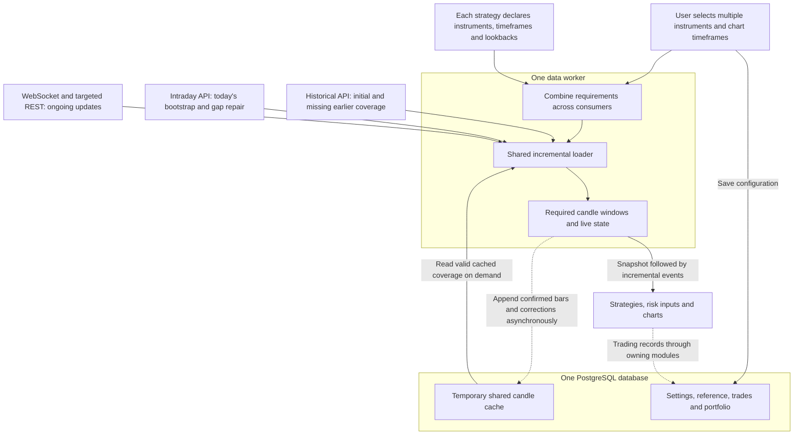

# Money Printer Live — data module implementation plan

Status: Consolidated design and implementation plan for review. Markdown only; no application implementation or runtime tests completed. Last reviewed: 23 September 2026.

This document is the current plan. Earlier capture/archive alternatives have been removed rather than left alongside contradictory requirements. Confirmed user decisions are distinguished from implementation recommendations and remaining release checks.

Navigation: [scope](#1-confirmed-scope), [review-decisions](#2-review-decisions--what-we-keep-and-skip), [architecture](#3-architecture), [requirements](#4-multiple-instruments-and-timeframes), [incremental-loading](#5-incremental-loading), [candle-correctness](#6-candle-and-event-correctness), [apis](#7-broker-api-scope), [postgresql](#8-postgresql-and-cache-lifecycle), [delivery](#9-runtime-delivery-and-scheduling), [recovery](#10-failure-handling-and-operating-defaults), [operations](#11-data-control-security-and-operations), [reuse](#12-money-printer-reuse), [build-sequence](#13-implementation-sequence), [tests](#14-test-plan), [release-checks](#15-release-checks-and-remaining-decisions).

## 1. Confirmed scope

- One application user initially; Upstox first, with common broker interfaces allowing later adapters.
- Multiple user-selected instruments and multiple concurrent strategy runs. Each run can need different timeframes/lookbacks across several instruments; the same strategy can also run independently on different instruments.
- Initial target: 26–100 unique active instruments, counting each option contract separately. This is a workload target to test, not measured capacity.
- The platform has four containers: application/frontend/backend, one shared data worker, the separately planned [Strategy Runner](STRATEGY_RUNNER_PLAN.md), and PostgreSQL. This data plan owns the application/data-worker/database data contracts, not the runner; build/test locally, then verify on the intended GCP machine.
- PostgreSQL is the only database. It holds a **temporary shared candle cache with no long-term market archive**, plus durable application/trading records owned by their respective modules.
- The worker shares requirements, reuses cached coverage, fetches missing data and maintains the required windows incrementally.
- Acquired live/REST results reach consumers directly and asynchronously. A cache write, commit or subsequent SQL read never gates delivery of that new observation.
- Ordinary bounded worker/consumer buffers support active calculations; they are not another database or an additional service.
- Stored records use append-only versions; temporary candle-cache expiry is a separate, protected lifecycle. Earlier retained versions are never overwritten to mark a row latest.
- Reuse Money Printer reference-data, Broker Control and relevant Data Control patterns by copying/adapting code later. The repositories and databases remain independent.

This plan owns instruments, live market data, temporary candles, Data Control and the interface to strategy/risk/chart consumers. It does not implement strategy logic, order placement, risk decisions or portfolio analytics. Their relationship is in [LIVE_PLATFORM_PLAN.md](LIVE_PLATFORM_PLAN.md). Orders, fills, portfolio and decision evidence remain durable; market-cache cleanup never governs their retention.

## 2. Review decisions — what we keep and skip

| Previous detail | Current treatment | Reason |
| --- | --- | --- |
| Different save switches for ticks, quotes and candles | Remove | Candle caching is automatic for declared needs; general market-history capture is outside scope |
| Shared `market_events` archive and full-feed payload retention | Remove | There is no raw tick/quote/chain archive in this application |
| Daily market journal export and archive verification machinery | Remove | User selected temporary PostgreSQL cache with no long-term archive |
| Three/five-session market retention and midnight reset | Replace with demand-based cache expiry | A two-month daily lookback must survive while needed; unrelated old data need not remain |
| Mandatory one-minute history for every timeframe | Remove | Fetch daily/other history directly; derive a larger timeframe only from suitable already-required complete inputs |
| One endpoint card/job/socket/table per symbol or timeframe | Remove | Shared requirements and acquisition are the intended architecture |
| All published Upstox APIs as first-release obligations | Separate supported requested products from optional catalogue | No blanket polling; options/derivatives remain supported by explicitly requested products |
| News, fundamentals, FII/DII, discovery smartlists and expired-history research | Defer | They are not necessary for the current incremental trading-data loader |
| Broker retries, rate accounting, stale/gap handling and restart recovery | Keep | A small system still needs to distinguish usable data from unavailable data |
| Append-only identity, correction versions, safe reference refresh and cache-cleanup protection | Keep | Prevent silent history replacement, duplicate work and deletion of active requirements |
| Multiple worker replicas, distributed failover, Redis/Kafka and partitioning | Defer | No measured requirement at this scope |
| Repeated old diagrams, implementation phases and overlapping test lists | Consolidate here | One current handoff; no instruction to implement superseded capture features |

Do not introduce a custom migration framework or generic event-sourcing platform merely to implement this plan. Keep the append-only requirement, but resolve the chosen migration tool's metadata compatibility as a small explicit prerequisite rather than assuming all of its default writes are compliant. No exemption to the user's all-table rule is silently granted.

## 3. Architecture

Inside the one worker, keep three responsibilities: requirement manager, shared loader and active data view. Broker adapters translate broker responses; the cache writer handles PostgreSQL I/O outside the receiver. These are modules/tasks, not additional containers.

The worker reads reusable cache coverage at bootstrap, added demand or recovery. It pushes newly acquired results to consumers immediately and writes confirmed candles separately. It does not repeatedly reread the entire PostgreSQL window on each tick. Broker credentials and authorized feed URLs never reach the browser.

Start with one private authenticated worker-to-application WebSocket for normalized events and ordinary private control requests. The application distributes data to strategy/risk/chart consumers. Container memory is not automatically shared. Broker Control remains the existing-copy prerequisite for account connection and manual login/token renewal.

## 4. Multiple instruments and timeframes

A strategy explicitly declares a set of requirements; the loader does not infer them by inspecting strategy code. Each requirement names:

| Field | Meaning |
| --- | --- |
| Consumer | User/chart or strategy-run identity; used to preserve shared ownership |
| Source and instrument | Broker/account entitlement, exact exchange/contract and compatible price/source policy |
| Product/timeframe | For example one-minute candles, daily candles, live price, option metrics or bounded tick window |
| Lookback | Completed-bar count or date/session window, including indicator warmup |
| Usability | Required fields, freshness, completion policy and any cross-instrument alignment requirement |

A user can select symbols/chart timeframes manually. A strategy adds its declared instrument/timeframe requirements automatically and visibly. Support the declared combinations, not every timeframe crossed with every selected symbol.

| Consumer | Instrument | Required candle windows | Live requirement |
| --- | --- | --- | --- |
| Strategy A | X | 1-minute: 15 bars; daily: 2 months | Price |
| Strategy A | Y | 5-minute: 50 bars | Price |
| Strategy B | X | 1-minute: 60 bars | Price |
| Strategy B | Z | 15-minute: 30 bars; daily: 1 month | Price and applicable OI |

This illustrative workload shares one compatible 60-bar minute series for X; A receives its latest 15-bar slice. Other instrument/timeframe windows are maintained independently. Share compatible in-flight requests and use the longest required lookback, not the sum across consumers. Different contracts, expiries or incompatible price bases remain separate.

“15 completed bars,” “15 clock minutes” and “two calendar months” are different requests. Resolve them using actual exchange sessions; do not substitute fixed trading-day counts or assume undocumented indicator warmup. Validate capacity and broker support before accepting requirements; never silently shorten lookback.

Readiness is per required instrument/product/timeframe. A calculation comparing several instruments becomes ready only when its mandatory inputs meet the declared coverage/freshness/alignment policy. Independently arriving prices are not an atomic market snapshot. Independent per-symbol evaluations can become ready separately when the strategy declares that independence. An unavailable instrument must not stop unrelated consumers.

User and strategy demand are tracked separately. Removing a user selection or stopping one strategy releases only that consumer's demand. Never disconnect another strategy's feed or trim its required history.

## 5. Incremental loading

| Event | Loader action |
| --- | --- |
| Initial subscription | Resolve shared requirements; inspect valid cached coverage; fetch missing/stale history in each requested timeframe |
| Live reception during bootstrap | Buffer a bounded overlap; combine history with arriving observations using an explicit handoff boundary |
| Bootstrap completes | Publish one consistent snapshot plus incremental events after its boundary; history is not replayed as new trade triggers |
| New confirmed candle | Advance only the affected series, publish the close event and enqueue its cache version independently |
| New daily bar | Refresh daily coverage when the exchange session's bar is available; no daily-history query on every minute/tick |
| Longer lookback/new timeframe | Fetch missing coverage once; other ready consumers continue |
| Changed/removed demand | Reconcile only changed requirements; reject obsolete responses by configuration generation |
| Gap/reconnect | Reacquire current state and repair required candle coverage; report missing tick paths honestly |

Fetch daily history directly for a daily requirement. Do not download months of minute data to produce it. Reuse complete lower-timeframe data for aggregation only when it is already needed and covers the correct session/window; otherwise request the target timeframe.

Maintain both known coverage and the last accepted bar boundary. A maximum timestamp alone cannot prove there are no earlier gaps. If an overlap buffer overflows, remain unready and repeat bounded catch-up; do not hide loss. Keep pending cache writes visible to the requirement manager so another consumer does not refetch data merely because its batch has not committed.

The [Upstox intraday endpoint](https://upstox.com/developer/api-documentation/v3/get-intra-day-candle-data/) documents instrument/unit/interval parameters and returns today's candles; it has no documented since-last-candle parameter. Incremental behaviour means fewer necessary calls and merging only new/corrected bars, not a promise that the broker sends a one-bar response. [Historical V3](https://upstox.com/developer/api-documentation/v3/get-historical-candle-data/) supports date windows with interval-dependent limits; filter any excess response to the required working set.

On restart, validate cached contract/source policy, timeframe, completeness and coverage, reacquire current state and repair gaps before Ready. Recheck a bounded recent overlap for corrections; do not assume all cached bars remain valid after a relevant contract or price-basis change. Any broader provider revision policy must be explicit rather than “last response wins.”

## 6. Candle and event correctness

The common interface provides history-ready snapshots, live prices/metrics, developing bars, completed bars, corrections and health status. Event names are implementation choices; their semantics are requirements.

- Identity includes exact contract, compatible source/price policy, timeframe and bar start. Source/market time, receipt/availability time and save time are separate facts. Unknown fields remain null.
- Developing bars can change in ordinary buffers; delivered events are immutable snapshots. A new LTP never changes the last completed candle's close.
- Confirmed-close policy must validate identity, interval, timestamps, coverage and required fields. Wall-clock rollover or sparse LTP alone is insufficient proof of complete OHLC/volume.
- Recommended initial authority is broker-confirmed candles. Batched previous-bar checks are a candidate where validated; fetched target-timeframe bars or complete aligned base bars can supply the chosen product. Do not impose one-minute source history on all timeframes.
- [OHLC Quotes V3](https://upstox.com/developer/api-documentation/get-market-quote-ohlc-v3/) documents current/previous bars but mixes previous-minute and previous-session wording. Validate actual interval/timestamp behaviour against intraday candles for every advertised class before enabling this close authority. Its documented OHLC payload does not include bar OI: never silently substitute current stream OI as historical bar-end OI. A consumer requiring that field needs a validated source/time association or remains unready for it.
- The permitted confirmation delay is part of the strategy input contract. If exceeded, mark incomplete and repair; a later repair is historical correction, not a delayed fresh entry trigger. No two-second or fifteen-second close policy is treated as already approved.
- Emit one live close per bar identity in a delivery generation. Later changes produce a correction revision; startup/reconnect/repair must not duplicate the original close signal. There is no cross-crash exactly-once execution claim.
- Aggregation uses first open, maximum high, minimum low, last close and per-bar volume sum. OI uses the appropriate observation, not a sum. Cumulative day volume and repeated last-trade quantity are not interchangeable with bar volume.
- Missing/no-trade bars, session breaks, partial final bars, holidays and commodity sessions need explicit treatment. Never manufacture flat bars to disguise gaps.
- Freshness belongs to each product/field. Fresh LTP cannot make old OI, Greeks or daily data fresh. Later external sources need compatible contract identity, adjustment basis and session alignment before merging.

Durable decision evidence belongs to OMS/portfolio records and must preserve the actual necessary values/versions used. An expiring candle-cache reference alone cannot establish what a strategy saw; refetched history may have corrections. That does not require archiving all market observations.

## 7. Broker API scope

The public API catalogue was reviewed in this discussion; intraday parameters, OHLC payload and standard rate limits were rechecked on 23 September 2026. Documentation is not account/segment validation. Maintain a small capability registry: source, supported scope/interval/fields, entitlement, batch limit and verification status. Unsupported combinations stay visibly unavailable.

| Source family | Role in this loader |
| --- | --- |
| [Instruments](https://upstox.com/developer/api-documentation/instruments/) and [market information](https://upstox.com/developer/api-documentation/market-information/) | Contract identity, local search, holidays/sessions/status; copy suitable reference code |
| [Market Feed V3](https://upstox.com/developer/api-documentation/v3/get-market-data-feed/) and [authorization](https://upstox.com/developer/api-documentation/get-market-data-feed-authorize-v3/) | Shared selected-instrument live feed; choose the least detailed compatible mode and respect actual account limits |
| [Historical V3](https://upstox.com/developer/api-documentation/v3/get-historical-candle-data/) / [Intraday V3](https://upstox.com/developer/api-documentation/v3/get-intra-day-candle-data/) | Required initial history, today and recoverable candle gaps |
| [LTP](https://upstox.com/developer/api-documentation/ltp-v3/), [full quotes](https://upstox.com/developer/api-documentation/get-full-market-quote-v3/), [OHLC quotes](https://upstox.com/developer/api-documentation/get-market-quote-ohlc-v3/) | Targeted snapshots/confirmation when required; avoid duplicating adequate stream observations |
| [Option contracts](https://upstox.com/developer/api-documentation/get-option-contracts/), [option chain](https://upstox.com/developer/api-documentation/get-pc-option-chain/), [Greeks](https://upstox.com/developer/api-documentation/option-greek/) | Explicit selected underlying/expiry/contracts and requested analysis inputs; no general snapshot archive |
| [OI](https://upstox.com/developer/api-documentation/get-oi/), [change in OI](https://upstox.com/developer/api-documentation/get-change-oi/), [PCR](https://upstox.com/developer/api-documentation/get-pcr/), [max pain](https://upstox.com/developer/api-documentation/get-max-pain/) | Retain as demand-driven product capabilities; preserve their actual date/bucket semantics, not an assumed tick cadence |

Implement/validate requested product adapters before advertising them. An endpoint that returns an entire expiry chain may have broader upstream scope than the selected output; show that scope, filter consumption and never automatically subscribe to all contracts returned. A chain/analytics response remains a typed transient observation, not a candle or a new stored event table.

For catalogue completeness, the [API index](https://upstox.com/developer/api-documentation/llms.txt) also lists discovery smartlists, FII/DII, news, fundamentals, expired history and older API versions. These are deferred; no collector is created just because an API exists. Portfolio/order streams are owned by their separate modules. External historical providers and additional brokers are later adapters, not live dependencies on the research platform.

## 8. PostgreSQL and cache lifecycle

### Minimal data-module storage

Five logical tables are the starting recommendation, reducing the previous six-table capture design by removing the raw-event archive. Names are proposed, not an implemented schema. Shared Broker Control/user and order/portfolio tables are outside this module count.

| Table | Responsibility |
| --- | --- |
| `instruments` | Versioned exact contract/reference metadata; active/retired identity and reference generation |
| `data_subscriptions` | Versioned consumer requirements and desired state; instrument/product/timeframe/lookback, source, freshness, schedule and ownership |
| `candle_cache` | Shared temporary confirmed candles and correction revisions across instruments/timeframes |
| `data_jobs` | Small reference/bootstrap/repair job lifecycle records and safe errors; no job row for every recurring quote poll |
| `runtime_state` | Compact operational records: committed reference/calendar versions, configuration application, gaps, meaningful status changes and rate reservations |

Use structured columns for identity/time/status/queried values; bounded JSONB only for variable reference/configuration payloads. Keep operational records small and without price/tick archives. Measure their growth; operational-history retention is a separate deployment setting, not permission for candle cleanup to delete other tables.

### Append-only and latest records

Every stored version has an immutable row ID, a stable logical entity ID, an increasing table-local append identifier and recorded time. Candles also have a bar identity/revision and source/availability times. Latest views select the head per logical entity; no mutable `is_latest` flags, conflict updates or replacing existing data. Increasing save order does not make a stale market observation fresh.

Store small complete configuration/status versions rather than building a generic replay engine. Serialize changes for the same control entity, check the expected predecessor and append in one transaction. Check retry identity before treating a repeated successful request as a conflict. Commit-order ambiguity must not cause concurrent edits to win incorrectly.

Retry inserts with the same immutable identity and values after an ambiguous commit. An identical existing row is success; same ID/different payload is an integrity error. Repeated unchanged broker candles create no new revision; genuine corrections append. Stable IDs and targeted unique indexes enforce this, rather than price/time equality alone.

Select the newest control/reference version before checking enabled/retired/revoked state, so an older active row cannot be resurrected. Reference refresh validates a complete generation and then commits its marker; partial generations stay invisible and previous valid identities remain usable. Preserve exact contract identity when a broker reuses a token or display symbol.

Runtime roles may read/insert but cannot overwrite/truncate stored rows. A dedicated cleanup path may expire eligible candle-cache rows only. Normal migrations run once under an administrative lock; validate schema on startup, preserve populated data, test additive upgrade/compatible rollback and never reset a database to bypass an error. The migration tool must honor the append-only tracking requirement or expose that compatibility issue before implementation; no custom framework is assumed.

### What is cached and when it expires

Cache only confirmed bars needed by declared windows, their necessary correction versions and bounded repair overlap. Developing bars/prices and requested tick windows use ordinary bounded active buffers; no raw market archive is created. One table serves all instruments/timeframes, with an index on compatible series identity and bar time/revision.

The required window is the union of active compatible consumer requirements. Recommended initial defaults are two extra completed bars for repair overlap and a 15-minute reuse grace after the last consumer releases a series. These remain tunable proposals. Active two-month daily lookback is retained while needed; it is not deleted by a fixed five-day policy or midnight reset.

Cleanup rechecks current requirement generation while coordinating with subscription changes. Protect active windows, necessary repair work and pending audit handoff. Expire entire obsolete bar histories coherently or preserve their authoritative revision; never delete a new correction and expose an obsolete version as latest. Do not keep every old correction indefinitely simply because a newer revision of the same active bar remains needed: release superseded unreferenced versions after the agreed recovery/evidence grace. Exact version grace is part of the final cache policy.

Durable trading records embed the required decision-time evidence or protect a source reference until handoff. They must not depend exclusively on an expiring cache foreign key. Reference foreign keys point to unique immutable reference versions, not nonunique logical IDs repeated across revisions. Cache expiry never deletes orders, portfolio records, user settings, credentials or needed instrument identities.

Cache persistence is asynchronous and bounded. A dropped/expired pending write produces a visible cache gap and later bounded repair when coverage is available; live consumers do not wait for it. Broker history can repair values, not the exact missing tick path or lost decision-time observation.

## 9. Runtime delivery and scheduling

Use one broker acquisition for compatible demand, then fan out through bounded consumer queues. Use separate status delivery so a slow consumer can be told it has a gap. Chart display may coalesce; a strict strategy stream must declare a gap/resync instead of silently skipping events. Keep expensive computation/serialization outside the common receiver. Profile before adding processes.

Persist desired settings and show Requested until the worker acknowledges Applied. Notify on changes and periodically reconcile in case notification is lost. A stale edit fails a version check; late responses from old request/credential generations cannot contaminate current state. Pausing a user selection does not remove an active strategy's separately owned demand.

Five-field cron schedules reference refresh and maintenance using explicit timezone/exchange sessions. Active streams and seconds-level requested snapshots use worker timers. Do not add host cron entries per symbol. Deduplicate scheduled/manual work, keep at most one outstanding poll per compatible scope and skip missed slots instead of replaying obsolete polls.

Exactly one worker owns the broker feed on the single host. Use a lifetime OS lock on the shared worker lock volume before opening sockets; a second worker remains unready. A missing database heartbeat does not authorize replacement ownership. This is not a multi-host failover design. Durable job transitions carry claim/generation tokens so stale attempts cannot complete newer work.

Startup validates schema, ownership, current credentials, reference/session state, desired requirements and rate windows; then it seeds valid cache, opens feeds and warms missing inputs. Each product becomes Ready independently. Shutdown marks unavailable, stops new work, drains pending writes only within a fixed grace period and reports any unflushed uncertainty. Restart does not automatically resume trading or claim lossless replay.

## 10. Failure handling and operating defaults

### Required responses

| Condition | Behaviour |
| --- | --- |
| Network timeout, HTTP 408/transient 5xx | Bounded retries with jitter; stop after attempt/usefulness limit; avoid retries in both SDK and wrapper |
| HTTP 429 | Respect Retry-After and the shared account/API limit group; skip a poll if the required wait makes it obsolete |
| Token failure/401 | Wait for a newer valid Broker Control credential; no repeated login attempts |
| Forbidden capability/403 or invalid scope | Explain unavailable capability/configuration; retry only after relevant correction |
| Partial/malformed/oversized response | Deliver valid selected members where safe; mark invalid/missing members; bound payloads and repeated source failures |
| Lost/silent socket | Ping/pong liveness, bounded reconnect and current-demand resubscription; mark gaps and require fresh state |
| Slow consumer | Isolate it, mark gap/unready and resynchronize; healthy consumers continue |
| PostgreSQL outage | Existing eligible live fan-out continues; settings/claims stop; new REST calls needing durable rate reservations pause visibly |
| Ambiguous cache commit | Retry identical version IDs; no duplicate revision or overwrite |
| Full/old writer queue or poison record | Bound memory/retries, isolate failure, record cache gap; never stall the receiver or silently claim saved coverage |
| Disk/permission/schema failure | Action-required state and low-frequency probe, not a write/restart storm |
| Worker/host crash | New generation, conservative budget recovery, cache validation and warmup; missing ticks remain missing |

Candle/price availability does not authorize orders when execution-audit or portfolio state is unavailable. That policy belongs to OMS/risk.

### Initial engineering defaults to test

These are recommended settings, not user-selected market semantics or demonstrated capacity.

| Setting | Initial recommendation |
| --- | --- |
| REST attempts | Three total attempts; connect 3 seconds/total 10 seconds for market reads; 5/30 seconds for history/reference; obey shorter usefulness deadline |
| Retry delay | REST jitter around 1 then 2 seconds; 429 minimum wait takes precedence |
| WebSocket reconnect | Exponential jittered backoff capped at 30 seconds; reset after 60 seconds healthy; 10-second connect deadline |
| Repeated source failure | After five failed poll cycles, 30-second circuit pause and one probe; repeated failure pauses up to 120 seconds; auth/config errors remain terminal until corrected |
| REST concurrency | Four market calls plus one bounded reference/repair lane; one in flight per identical scope; fair scheduling across instruments |
| Configuration/health | Reconcile and publish health every 5 seconds; missing worker health after 15 seconds is visible; persist transitions and sparse summaries |
| Cache writer | Flush by 250 ms, 500 rows or about 1 MiB, whichever first; retries 1, 2, 4, 8 then at most 30 seconds with jitter |
| Queue limits | Explicit record, byte and age bounds for receiver/overlap, each consumer and writer; include in-flight batches and object overhead; choose measured limits before release |
| Graceful shutdown | Initial 20-second writer drain within at least 30-second container stop grace |

Freshness and consumer-lag tolerances are declared per product/workload; a universal “no trade for two seconds means broken” rule is inappropriate for illiquid instruments. The exact close-confirmation deadline is a separate decision in section 15.

### Rate budget and recovery

Use one account/API-group budget across bootstrap, polling, confirmation, repair and retries. The currently documented standard ceilings are 50/second, 500/minute and 2,000/30 minutes; verify the actual endpoint grouping and any other callers sharing the account. One request per minute for 100 symbols is 3,000 per 30 minutes for that endpoint, so naive per-symbol polling is not admissible. [Upstox rate limits](https://upstox.com/developer/api-documentation/rate-limiting/)

Reuse/adapt the existing budget store: append compact per-attempt reservations under a group lock before sending; count the relevant time windows. No market payload is stored in reservations. Account for a bounded reserve-to-send delay; expired send admission requires a new reservation and an uncertain attempt is not refunded. Recover budgets across restart; if history is missing, wait conservatively rather than starting with an empty window. If the reservation store is unavailable, pause new REST admission, not established WebSocket reception.

These operational records are distinct from a raw market archive. Their growth/retention needs a bounded operational policy before deployment, while preserving every still-active rate window; they must not force an unbounded log of rolling-window copies.

## 11. Data Control, security and operations

Keep the UI centered on selected work, not API endpoint cards:

| View | User-visible information |
| --- | --- |
| Instruments and consumers | Selected contracts, chart/strategy owners, actual shared demand and safe add/remove/pause actions |
| Required data | Timeframes/products, lookbacks, requested versus available coverage, pending bootstrap/repair |
| Health | Per-product freshness/readiness, source/receipt time, gaps, login state and requested/applied configuration |
| Cache | Reusable coverage, last committed candle, pending writes/errors and estimated size; no general save toggle |

Show errors with an action: log in, correct an unsupported request, wait for warming, repair or inspect storage. A connected socket is not proof all required inputs are Ready. De-duplicate repeated alerts and report recovery; no per-tick notifications.

Only the application is externally reachable. Keep PostgreSQL and worker/control endpoints private; authenticate browser/control/stream access and protect cookies/origins. Credentials remain encrypted server-side with independently recoverable keys. Redact secrets and market payloads from routine logs; do not create an accidental raw history store there. Use pinned images/dependencies, resource limits, bounded logs and a persistent PostgreSQL volume.

Separate liveness from product readiness; broker outages should not cause container restart loops. Monitor event latency/queue age, dropped/gap counts, retry/rate waits, resource use, disk growth, reference freshness and backup results. Configure a host-external uptime check on GCP and an operator alert destination before deployment. No particular notification service is required by the architecture.

Back up durable configuration/trading state and encryption keys off-host, and test an isolated restore. Exclude disposable candle-cache contents from the long-term operational backup dataset where supported; recreate the cache schema and refetch required windows on restore. A full snapshot that incidentally includes cache data must not be treated as a market archive, and its retention must be bounded. Fix the durable-data recovery point/time before production; a once-daily backup alone does not protect every intraday order write from total host loss.

Deliver a short operational recovery procedure for expired tokens, broker outage, database/disk failure, stuck worker, failed reference refresh and upgrade/restore. A restored instance validates configuration, credentials and rate windows before acquisition; it never assumes permission to resume trading. Verify HTTPS callbacks, time synchronization, broker egress configuration and resources on the actual GCP host after local tests.

## 12. Money Printer reuse

Copy and adapt only the required reference/broker/control code and its tests. Preserve normalization, identity, calendar coverage, failed-refresh safety and request sharing. Replace mutable reference replacement writers with append-only versions/committed generations. Do not copy the research save-then-reread delivery workflow, historical database, unrelated features or past credentials.

Verified source entry points:

- [Instrument catalogue decoding and normalization](/Users/yuktrix/Money_Printer/src/brokers/upstox/instruments.py)
- [Instrument refresh service](/Users/yuktrix/Money_Printer/src/money_printer/application/instruments/refresh.py)
- [Local instrument search](/Users/yuktrix/Money_Printer/src/money_printer/application/instruments/search.py)
- [Upstox calendar adapter](/Users/yuktrix/Money_Printer/src/brokers/upstox/market_calendar.py)
- [Calendar application service](/Users/yuktrix/Money_Printer/src/money_printer/application/market_calendar/service.py)
- [Calendar refresh runner](/Users/yuktrix/Money_Printer/src/money_printer/application/market_calendar/runner.py)
- [Instrument refresh tests](/Users/yuktrix/Money_Printer/tests/unit/application/test_instrument_master_core.py)
- [Calendar tests](/Users/yuktrix/Money_Printer/tests/unit/application/test_market_calendar_core.py)

Other reference patterns:

- [Data Control schedules](/Users/yuktrix/Money_Printer/src/money_printer/application/data_control/schedules.py)
- [Data Control worker](/Users/yuktrix/Money_Printer/src/money_printer/application/data_control/worker.py)
- [Market-data runners](/Users/yuktrix/Money_Printer/src/money_printer/application/market_data/runners.py)
- [Shared request budget](/Users/yuktrix/Money_Printer/src/money_printer/application/market_data/rate_limit.py)
- [Broker interfaces](/Users/yuktrix/Money_Printer/src/brokers/interfaces.py)
- [M3 plan](/Users/yuktrix/Money_Printer/docs/broker/upstox/UPSTOX_M3_REST_MARKET_DATA_PLAN.md)

These paths were inspected in this discussion and remain reference points, not evidence that the copied code works in this repository. Recheck actual dependencies/tests during implementation. Reuse Broker Control's login/encryption interfaces; its full UI and the order/portfolio contracts remain owned by the overall plan.

## 13. Implementation sequence

| Phase | Deliverable | Required exit evidence |
| --- | --- | --- |
| P1 — foundation | Data-layer foundation within the four-container platform: single-user access, Broker Control prerequisites, private transport and versioned schema; runner work is owned separately | Clean/repeat startup, credentials protected, incompatible schema rejected |
| P2 — references and requirements | Reference reuse; multi-instrument/timeframe declarations; sharing and ownership | Valid identities; failed refresh preserves last good generation; correct requirement union |
| P3 — incremental candles | PostgreSQL cache; bootstrap, coverage, timeframes, gap merge and revisions | User's minute-plus-daily example; cache reuse and concurrent demand tests |
| P4 — live integration | Shared feed, requested REST products, validated candle completion and direct delivery | Correct handoff, field/segment capability checks, bounded latency and no duplicate close triggers |
| P5 — recovery and control | Rate/retry/ownership handling, protected expiry, truthful UI, security and operational procedures | Failure injection, slow-consumer/database isolation, backup/restore and lifecycle tests |
| P6 — release verification | Mixed 100-instrument workload, session soak and read-only broker checks; repeat on GCP | All applicable tests/evidence and section 15 gates satisfied |

Use fake broker/test consumers in early phases. No strategy/order implementation is needed to prove the data contract. Each phase integrates with the preceding one; no duplicate loader or parallel runtime stack is introduced.

## 14. Test plan

All tests are specifications with status **NOT RUN**. This consolidated suite supersedes the earlier capture-toggle/archive test lists. M01–M20 preserve the current incremental-loader cases; V01–V30 cover the retained production safeguards. Passing one case does not establish an unsupported capability.

Use deterministic clocks/jitter for unit tests; a dedicated disposable PostgreSQL database and fake HTTP/WebSocket broker for integration; real application controls for browser tests; isolated backup/restore tests. Serialize suites that reset the same database. Live broker checks are explicitly enabled and read-only, never order placement. Test each advertised instrument-class/product combination, including applicable commodity sessions and derivative contracts.

### Incremental loader cases

| Case | Expected behaviour |
| --- | --- |
| M01 — 15 one-minute bars plus two calendar months of daily bars | Requests match each timeframe/lookback; correct sessions and complete-bar boundaries; no two-month minute download |
| M02 — repeated strategy evaluation with no missing coverage | No repeated history requests; current live data is pushed directly |
| M03 — a new minute closes | Only that series advances after valid confirmation; daily completed history is not unnecessarily refetched |
| M04 — exchange session completes | One shared eligible daily refresh; developing daily state does not become complete early |
| M05 — two consumers request overlapping windows concurrently | One shared acquisition/in-flight request; longest compatible window serves both |
| M06 — enlarge lookback or add timeframe | Only missing coverage/new timeframe fetched; existing ready consumers keep working |
| M07 — duplicate or corrected broker bars | Stable identity deduplicates unchanged bars; corrections carry revisions and do not replay the original close signal |
| M08 — stop one consumer or return a cancelled old response | Other demand survives; stale responses do not resurrect removed scope |
| M09 — timeout, rate limit, token expiry and data gap | Bounded retries, visible readiness and recovery; no fabricated coverage |
| M10 — full-day intraday response for a small repair | Worker merges needed/new/corrected rows without duplicating history or claiming a delta-only API |
| M11 — restart with populated, partial or stale PostgreSQL cache | Valid coverage reused; missing/stale windows repaired; live state reacquired; no stale Ready state |
| M12 — multi-symbol mixed sessions and slow consumer | Correct timeframe/session boundaries, bounded resources and isolated live delivery |
| M13 — cache expiry versus new demand and durable evidence | Required windows survive concurrent subscription changes; unused data expires under selected policy; durable evidence survives; no long-term market archive |
| M14 — pending writes, repeated observations and corrections | Shared acquired data reused before commit; unchanged responses create no extra revision; actual corrections append; writes never gate delivery |
| M15 — operational backup/restore | Durable records restored; disposable cache recreated/refilled; no hidden long-term candle archive through backups |
| M16 — one user and one strategy request multiple instruments/timeframes | Every declared combination receives the right source/series; undeclared combinations are not loaded |
| M17 — multiple strategy runs overlap on some instruments/timeframes | Compatible acquisitions and windows shared; consumer lookbacks remain correct; no duplicate history calls |
| M18 — add/remove an instrument or stop one strategy | Only changed demand is reconciled; remaining users of the feed/cache remain unaffected |
| M19 — cross-instrument strategy with one missing/stale input | Required group remains unready; independent healthy groups continue; no fabricated simultaneous snapshot |
| M20 — concurrent multi-instrument bootstrap plus live traffic | Bounded fair work, correct event routing and isolated readiness; unique-instrument limits checked after deduplication |

### Production safeguard cases

| Case | Expected behaviour |
| --- | --- |
| V01 — fresh/repeat startup, concurrent migration and incompatible schema | One non-destructive migration owner; expected schema only; useful readiness error |
| V02 — populated upgrade and compatible rollback | Stored identities/values survive; append-only migration tracking verified; unsafe rollback refused |
| V03 — valid, corrupt, oversized and interrupted reference refresh | Correct metadata/search; committed generation only; previous catalogue usable on failure |
| V04 — symbol/token reuse, expiry and session reference | Exact contract identities remain distinct; holidays, breaks, commodity sessions and stale references handled |
| V05 — duplicate create/Run-now and concurrent stale edit | One logical operation; valid append-only transition; expected-version conflict visible |
| V06 — lost control notification and in-flight configuration change | Reconciliation applies latest state; Requested is not prematurely Applied; obsolete responses cannot resurrect demand |
| V07 — feed initial state, partial fields, units and invalid input | Snapshot differs from live trade; null differs from zero; payload bounds and correct IV/volume/OI applicability |
| V08 — slow strict consumer, chart congestion and disconnect | Healthy consumers continue; charts may coalesce; strict gaps force explicit resync; buffers bounded |
| V09 — silent socket, reconnect and old-session frames | Liveness recovery with new generation; current demand restored; stale frames do not regress state |
| V10 — unsupported modes, instrument limits and missing initial snapshot | Request rejected/degraded accurately; no extra socket per strategy or false Ready |
| V11 — all requested REST product contracts and partial batches | Correct selected output, missing-member status and actual data granularity; no hidden market-history payloads |
| V12 — timeout/408/5xx, invalid request, 401 and 403 | Bounded retry/deadline; terminal auth/capability/config errors distinguished; no SDK retry multiplication |
| V13 — 429 and shared budgets across retries/restart | Valid Retry-After obeyed; all applicable windows respected; uncertain history recovered conservatively |
| V14 — overlapping cron/manual work and slow/missed polls | Work deduplicated; one in flight per scope; no obsolete backlog; no per-poll job growth |
| V15 — candle authority for each segment, late/wrong/future bars and missing OI | Completion/required fields verified; unavailable data stays unready; no current OI relabelled as historical bar-end OI |
| V16 — aggregation, missing/no-trade bars, volume/OI and partial sessions | Correct alignment/units; no invented coverage; no OI sum or cumulative-volume misuse |
| V17 — snapshot handoff, warmup overflow, late confirmation and corrections | Consistent event boundary; unready on loss; no replayed historical triggers or duplicate closes |
| V18 — append-only rows, concurrent control versions and latest selection | Earlier retained values unchanged; latest selection per entity; disabled/retired/revoked state cannot resurrect |
| V19 — ambiguous commits, repeated bars and conflicting duplicate identity | Same write is idempotent; unchanged bar adds no revision; conflicting contents fail; correction appends |
| V20 — expiry concurrent with demand, correction revisions and audit handoff | Needed coverage/evidence protected; expiry cannot reveal an obsolete revision as current or touch durable trading records |
| V21 — PostgreSQL outage, slow writes, disk full, poison record and overflow | Live path remains independent; REST reservations never bypassed; bounded cache-write failure and visible gaps |
| V22 — two workers, interrupted jobs, crash and graceful shutdown | One owner; stale token cannot complete newer job; bounded drain and honest recovery uncertainty |
| V23 — unauthenticated/forged requests and secret handling | Access denied; private endpoints protected; secrets absent from browser/logs; encryption failure explicit |
| V24 — database privileges and credential rotation/revocation | Runtime cannot update/truncate; cache-expiry path constrained; encrypted credential versions append with no fallback to revoked tokens |
| V25 — UI and product health during broker/DB/session failure | Correct independent states and recovery actions; no false Ready or restart loop |
| V26 — isolated backup/restore and alert/host outage | Durable records/key usable; cache rebuilt; recovery measured; external outage and recovery visible |
| V27 — 100-instrument overlapping multi-timeframe load | Required workload served fairly; latency/queue/capacity targets recorded; no redundant bootstrap storm |
| V28 — burst plus slow DB/consumer and long-session soak | Healthy paths responsive; bounded memory/tasks/connections; gaps explicit; cache/operational growth measured |
| V29 — read-only broker smoke across advertised classes/products | Actual schema, timestamps, field coverage, modes and session behaviour validated; unsupported entries disabled |
| V30 — same images on GCP, upgrade and evidence review | Host-dependent performance/recovery reproduced; all mandatory results recorded; no NOT RUN item represented as passed |

Use baseline row hashes/IDs when proving append-only behaviour. Performance tests record payload size, unique instruments, timeframe windows, consumer count, request rate, revision/image and host resources; do not use symbol count alone as a benchmark.

## 15. Release checks and remaining decisions

The architecture is now consistent with the user's selected scope. It is not yet production-certified. Keep these few choices visible rather than treating earlier proposals as accepted facts:

| Decision / evidence | Required before release |
| --- | --- |
| Candle-close authority and tolerated delay | Validate broker contract per advertised product; define completion/no-trade/late-repair behaviour required by strategies |
| Cache and operational expiry | Confirm repair overlap, unused-series and old-revision grace, operational-history limits and protected evidence; validate under concurrent demand |
| Capacity and freshness | Fix maximum admitted lookbacks/bytes, queue bounds, required modes and per-consumer freshness/alignment; measure on intended host |
| Operational recovery | Set backup recovery point/time and alert destination; demonstrate restore, upgrade and operator procedures |

Retain benchmark discipline without claiming an arbitrary latency guarantee. The previous p95 10 ms/p99 25 ms steady and p99 100 ms fault targets are provisional engineering benchmarks to validate or explicitly revise, not approved strategy timing. A provisional synthetic workload is 1,000 normalized updates/second with a 3,000/second 60-second burst across 100 instruments and overlapping consumers; compare with actual intended feed behaviour. Measure receipt-to-consumer latency separately from broker delay, REST availability and candle confirmation, and measure cache commit lag independently. Include slow-storage tests proving no database wait in live delivery.

Release requires: implemented current phases; all applicable M/V cases passed with evidence; no hidden or fabricated gaps; correct cache/append-only semantics; acceptable measured capacity; successful durable backup/restore; active-session read-only broker validation; and host-specific GCP verification. Unsupported products remain disabled and visible. Live-order authorization belongs to a later OMS/risk release.

Document-only completion: the obsolete capture design is removed and the current loader, cache, controls, recovery, build phases and tests are consolidated. Implementation, test execution and deployment remain pending.
