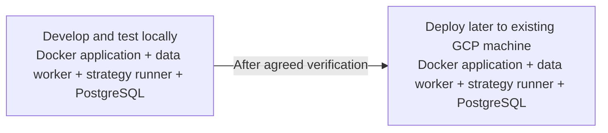

# Money Printer Live — overall platform plan

Status: Discussion and planning. The live market-data/Data Control and Strategy Runner designs are covered for their current scopes. Other module boundaries are agreed, but their detailed planning is still open. Colors below indicate planning status, not implementation or production readiness.

Last updated: 24 September 2026.

## 1. Purpose and ownership of this document

Build an independent application for live strategy operation, order execution, risk management, portfolio monitoring and performance analysis.

This document owns the overall architecture, module boundaries and deployment direction. Detailed live market-data and Data Control decisions belong only in [the data plan](LIVE_MARKET_DATA_AND_DATA_CONTROL_PLAN.md).

This is a plan, not evidence that the application, containers or database have been implemented.

## 2. Confirmed scope

| Area | User decision |
| --- | --- |
| Repository boundary | Research and backtest validation live in a separate repository. There is no connection between that repository and this live application. |
| Application users | Start with one user. This replaces the earlier shared-user and administrator-controlled multi-user proposal. |
| Brokers | Implement Upstox first. Use common interfaces so additional brokers can be added later. |
| Broker Control | Provide broker login, daily user-initiated token renewal, connection status and disconnect. Copy and adapt the existing Money Printer broker-control implementation when building this application. |
| Data interfaces | Portfolio data and live market data are separate submodules, with their own pipelines, within the common data layer. |
| Execution interfaces | Use a common broker execution interface, separate from common broker data access. |
| Strategy operation | Subscribe to multiple symbols and run multiple strategies concurrently. The same strategy can run on several symbols. |
| Order routing | A strategy signal can target one broker or several brokers, using the user's broker/account selections made in the frontend. |
| OMS action scope | The OMS must support automatic individual place/modify/cancel, bulk placement, application-built modify-many and cancel-many, and account-wide exits, each with explicit authority and safety rules. Only platform Risk Management may initiate account-level bulk cancel or exit-all; strategies cannot invoke those operations directly. Exit-all may affect positions originating outside this application, while modify/cancel cannot target outside-application orders. Upstox is the first execution adapter; the starting application supports one connected account per broker. |
| Manual order actions and provenance | The user can place orders manually and modify/cancel only orders created by this application and verified as linked to it. Orders observed from outside this application are read-only for modify/cancel. Record the origin of every application action separately as strategy run, manual user or platform Risk Management, preserving later changes to an order originally placed by another origin. |
| Risk management | A standard Risk Management submodule belongs inside Order Management and Execution. Strategies send risk signals as well as trading signals. |
| Portfolio views | Plan investment, swing trading and intraday views. Focus first on the intraday view. |
| Portfolio broker selection | Support an individual broker view and, after additional brokers are introduced, a combined view. |
| Account activity coverage | Persist broker-reported activity for the whole connected account, including activity initiated through this application and activity observed from Upstox outside it. Keep the application's intent-to-order trace separately linked to broker facts. |
| Development order | Build and test locally in Docker, then deploy to the user's existing GCP machine. |
| Container baseline | Four containers: frontend/backend application, dedicated live market-data worker, strategy runner for user-supplied Python, and PostgreSQL. |

Multi-user permissions, shared-account access and combined performance across different application users are not part of the starting scope.

## 3. Four-module architecture with shared Broker Control

Planning-status legend: **green — design covered**, **orange — detailed planning still needed**, **blue — reuse approach selected**, **grey — later phase**. Text labels carry the same status for readers whose renderer does not display colors. Colors use theme variables for the document's light/dark display.

```mermaid
flowchart TB
    brokerControl["REUSE: Broker Control and daily login"]

    subgraph dataModule["1. DATA — Common data interfaces"]
        marketData["COVERED: Live market data and Data Control"]
        accountData["TO PLAN: Portfolio and account-data pipelines"]
    end

    subgraph strategyModule["2. STRATEGY"]
        strategy["COVERED: Strategy Runner plan"]
    end

    subgraph executionModule["3. ORDER MANAGEMENT AND EXECUTION"]
        oms["TO PLAN: Order lifecycle and account routing"]
        risk["TO PLAN: Standard risk management"]
        execution["TO PLAN: Broker execution and recovery"]
        audit["TO PLAN: Execution and risk audit records"]
    end

    subgraph portfolioModule["4. PORTFOLIO MANAGEMENT"]
        portfolio["TO PLAN: Reconciliation and intraday analytics"]
        futureViews["LATER: Investment and swing views"]
    end

    brokerControl -.->|"Authorized access"| marketData
    brokerControl -.->|"Authorized access"| accountData
    brokerControl -.->|"Authorized access"| execution
    marketData -->|"Required data"| strategy
    marketData -->|"Live prices"| risk
    strategy -->|"Trading signals"| oms
    strategy -->|"Risk signals"| risk
    accountData -->|"Positions and account state"| risk
    risk <-->|"Actions and actual order state"| oms
    oms <--> execution
    oms --> audit
    risk --> audit
    accountData -->|"Broker facts"| portfolio
    audit -->|"Execution evidence"| portfolio
    portfolio -.-> futureViews

    classDef covered fill:var(--green),fill-opacity:0.18,stroke:var(--green),color:var(--foreground)
    classDef pending fill:var(--orange),fill-opacity:0.18,stroke:var(--orange),color:var(--foreground)
    classDef reuse fill:var(--blue),fill-opacity:0.18,stroke:var(--blue),color:var(--foreground)
    classDef later fill:var(--muted),stroke:var(--muted-foreground),color:var(--foreground)
    class marketData,strategy covered
    class accountData,oms,risk,execution,audit,portfolio pending
    class brokerControl reuse
    class futureViews later
```

The four main modules remain Data, Strategy, Order Management and Execution, and Portfolio Management. Broker Control is a shared facility. Dashed authorization arrows represent use of account-bound backend connections, not passing tokens to strategy code.

The live market-data/Data Control portion of Data and the Strategy Runner design are green. Portfolio/account-data acquisition is a separate pipeline and remains orange. Green means the design discussion is covered enough to move to the next module; the respective plans still own their release checks, and nothing is marked implemented.

Blue Broker Control means copy/adapt the existing Money Printer implementation; it is not already integrated in this repository. Grey investment/swing views are deliberately deferred. Local/GCP deployment direction is agreed, with detailed platform integration and operational verification still outstanding; see section 9.

### Shared Broker Control — reuse the existing implementation

The user will log into Upstox and manually renew broker access each trading day through Broker Control. The page also shows connection status and supports disconnect/reconnect. In this plan, token renewal means the user-initiated login/authorization flow that obtains a new access token; it does not assume an automatic refresh-token API. Upstox documents this login and code-exchange flow in its [authentication documentation](https://upstox.com/developer/api-documentation/authentication/).

Reuse the existing Money Printer broker-control code rather than design it again: copy and adapt the Broker Connections frontend, broker routes, connection/OAuth services, encrypted credential/token storage, persistence and relevant tests into this repository during implementation. Configure the new application's local and GCP callback URLs and database independently. The source code exists in Money Printer; it has not yet been copied or verified in this repository.

Broker Control owns authorization and connection state. The data and execution interfaces use those connections for broker calls. Strategy and portfolio modules use their existing data/execution paths and do not manage tokens themselves. A renewed token alone does not imply that a stopped strategy or order resumes automatically; recovery behaviour remains part of the later runtime discussion.

Existing implementation entry points:

- [Broker Connections frontend](/Users/yuktrix/Money_Printer/frontend/src/BrokerConnections.tsx)
- [Frontend broker API client](/Users/yuktrix/Money_Printer/frontend/src/broker-api.ts)
- [Broker HTTP routes and OAuth coordination](/Users/yuktrix/Money_Printer/src/money_printer/web/brokers.py)
- [Connection service](/Users/yuktrix/Money_Printer/src/money_printer/application/broker/service.py)
- [Credential service](/Users/yuktrix/Money_Printer/src/money_printer/application/broker/credentials.py)

## 4. Data module

The data module has two separate responsibilities:

- Portfolio data: obtain broker-reported account facts such as funds, holdings, positions and trade reports.
- Live market data: obtain market observations needed by charts, strategies, risk monitoring and valuation.

Broker adapters translate requests and responses. The application owns configuration, scheduling, persistence and delivery to consumers. Strategies use the common data service rather than opening their own broker connections.

The live market-data/Data Control design is covered in [the data plan](LIVE_MARKET_DATA_AND_DATA_CONTROL_PLAN.md), including shared multi-instrument/multi-timeframe loading and temporary PostgreSQL caching. Its detailed contracts remain there. The approved portfolio/account-data design is in the [Portfolio and Account Data Plan](PORTFOLIO_ACCOUNT_DATA_PLAN.md); its agreed shape is summarized below. Portfolio P&L/reporting definitions remain separate work.

### 4.1 Portfolio and account-data acquisition

Keep one account-sync owner per broker account inside the application backend; do not add a container or host cron job for the MVP. Broker Control supplies its authorized connection. The sync service combines three triggers through one validation, deduplication and reconciliation path: Upstox portfolio-stream updates, scheduled read APIs, and immediate checks after an application order, login, reconnect or uncertain result. The portfolio UI reads PostgreSQL rather than calling Upstox when a page opens. The separate market-data worker supplies current valuation prices.

The agreed initial schedule is: a complete baseline after login/reconnect; stream updates as they occur; order, trade, position and funds verification about every minute while trading; holdings checks about every five minutes; payment checks hourly while connected; and daily report imports and opening/closing checkpoints. Idle and closed-session work should be reduced. Scheduling must use the relevant exchange session and a shared broker-account rate budget. Persist changed versions and opening/closing checkpoints; an unchanged check leaves a small observation record. Exact failure thresholds and endpoint-specific exceptions remain to be finalized against read-only broker checks.

Keep the last good facts and their source/receipt times when a call fails. Show account data as Current, Delayed or Unverified; a stream gap, uncertain order result or broker disagreement is Unverified for the affected scope until a fresh read reconciles it. A reconnect requires a complete available-account read before returning to Current. The proposed order/risk boundary is to pause new exposure that depends on unverified account state; protective-action behavior belongs to the later OMS/risk plan. Do not silently fill gaps that the broker APIs can no longer recover.

The accepted logical storage groups are account identity and observations (`broker_accounts`, `account_observations`); versioned profile, funds and portfolio snapshots (`profile_versions`, `funds_snapshots`, `portfolio_snapshots`, `portfolio_snapshot_rows`); the application's intent and attempt trace (`app_order_intents`, `app_order_attempt_events`); broker orders and fills with verified links to our instructions (`broker_orders`, `broker_order_versions`, `broker_fill_versions`, `app_broker_order_links`); and cash/report evidence (`cash_transfer_versions`, `report_imports`, `report_lines`). Broker credentials stay in Broker Control's protected storage, outside these account-history tables.

For these tables, use one stable account row per broker and broker user ID; scope broker order, trade and cash-transaction keys by that account. Every derived broker fact references the observation that supplied it. Store broker event time when supplied, application observation time and database write time separately; use exact decimal types for money, prices and quantities. A repeated unchanged read creates only a small receipt; a changed state or agreed checkpoint creates an append-only version. A complete portfolio snapshot owns its rows, and failed/partial reads cannot imply absent holdings or zero balances. Keep full source payloads for changed results, checkpoints and distinct order/fill events, but only hashes and small receipts for unchanged checks. Apply each observation and its derived rows atomically. Current state can be derived from indexed accepted versions without extra current-copy tables for the MVP. Physical migrations and live API field validation remain implementation work.

### 4.2 Account reconciliation

Keep each distinct broker observation and derive current state from the evidence; do not use arrival order alone to decide which status wins. An application intent proves what this application attempted, not broker acceptance or a fill. A broker order is linked to an application instruction only through a returned broker identifier or a validated unique tag with matching account/order evidence. Unlinked broker activity remains in whole-account totals without strategy attribution.

Use stream messages for prompt changes, current-day order book/history to confirm broker order state, identifiable broker trades for each actual partial fill, and complete funds/position/holding reads for account state. Repeated observations do not duplicate orders or fills. Cross-check filled quantity against distinct trades and position state, but never synthesize a fill from a quantity difference. When sources disagree, preserve both observations and mark the affected scope Unverified until later broker evidence resolves it; an older or failed read must not overwrite a newer supported fact or zero out missing rows.

Persist an order instruction before submission. If the broker submission result is uncertain, keep the attempt Unknown, check available order/history/trade evidence, and never blindly resend. After a stream gap, reread available current-day orders/trades and account snapshots; recover current state where possible while retaining visible gaps in intermediate history. Detailed retries, protective actions and admission behavior remain OMS/risk decisions.

### 4.3 History coverage and account readiness

On first connection, capture current profile, funds, holdings, positions, payments and current-day orders/trades before assessing current account readiness. Import available historical trades and reports in bounded background pages; historical completeness is separate from current readiness and must not delay current-state checks. Record coverage by source, account, period and result in account observations, including partial imports and unrecoverable gaps. Upstox currently offers historical trades for the last three financial years, current-day order history, and only the latest 20 pay-ins and payouts per read; do not infer a complete lifetime ledger from these APIs. After an outage, recover current state through full reads but retain any missing intermediate order-event interval as an audit gap. An import is complete only after every required page and count is checked.

Compute Current, Delayed and Unverified separately for identity, orders/fills, positions, funds, holdings and historical coverage. A current account can coexist with an older reporting gap. During active trading, the initial proposed thresholds are: order/trade verification within 120 seconds with a healthy portfolio stream and no unknown submission or discrepancy; positions within 90 seconds; funds shown Current within 120 seconds and reread if older than 60 seconds before a cash-consuming order; holdings shown Current within 10 minutes and reread if older than five minutes before an action dependent on holding quantity. Profile identity must match on login. Payments, reports and older-history gaps are reported separately and do not alone block new exposure. A stream gap, incomplete response, unknown order outcome or broker disagreement makes the affected scope Unverified; a merely overdue valid value is Delayed. New exposure depending on Unverified account state is paused; detailed protective behavior belongs to OMS/risk. Expected Upstox funds maintenance from 00:00 to 05:30 IST leaves the last value visible as delayed and requires a successful new read before a funds-dependent order.

## 5. Strategy module

The user can select multiple instruments and run several strategies at the same time. One strategy run can use several instruments/timeframes, and the same strategy definition can also run independently on different instruments. Each run remains distinguishable in downstream signals and records. Its data requirements use the common loader contract.

The user edits a saved Python strategy in the frontend and updates the same strategy ID. A dedicated strategy-runner container executes active runs and returns trading and risk intentions to the application. The full contract, isolation method, code-update behavior, incidents and recovery are in the separate [Strategy Runner plan](STRATEGY_RUNNER_PLAN.md).

Strategies consume live market data and produce two kinds of output:

| Output | Meaning | Destination |
| --- | --- | --- |
| Trading signal | An intended entry or exit | Order Management System |
| Risk signal | Set or update stop loss, take profit or trailing-stop instructions | Risk Management |

Historical/current-day candles, live updates and data-readiness semantics are covered by the data plan. Strategy evaluation and run-control contracts are covered by the Strategy Runner plan; OMS and Risk Management must still define their own admission, order and protection policies.

## 6. Order Management and Execution module

### Accepted OMS decisions — baseline for the final design

The following decisions are agreed for the Upstox MVP. They define scope and safety boundaries; they do not mean the OMS is fully designed, implemented or authorized for live orders. The detailed explanations and remaining decisions follow below.

| ID | Accepted decision |
| --- | --- |
| OMS-01 — Broker boundary | Upstox is first, with one connected account per broker. Use a common execution interface with broker-specific capabilities so later brokers can be added. Route and reconcile each broker account independently; a multi-broker action is not atomic. |
| OMS-02 — Order families | Support Intraday (`I`) and Delivery (`D`), ordinary Market, Limit, Stop Loss Limit and Stop Loss Market orders where permitted, plus single-leg and multi-leg GTT. GTT is a separate order family, not a product code. MTF placement and Upstox's beta GTT trailing feature are outside the MVP. |
| OMS-03 — Actions | Support automatic individual place/modify/cancel, Upstox multi-place, application-built modify-many and cancel-many using individual broker calls, GTT place/modify/cancel, and account-wide exit. Every action requires an explicit authority and safety check. |
| OMS-04 — Account-wide authority | Only platform Risk Management may initiate account-level emergency cancel or exit-all; a strategy cannot call either directly. Emergency cancel targets explicit, verified app-created pending orders, including app-created manual orders, through individually tracked cancels. The native Upstox Cancel Multi endpoint is mapped but is not used for this action because its selection can include outside-app orders. Exit-all may affect every position in the selected broker account, including outside-app positions. |
| OMS-05 — Run ownership | A strategy run may act only on its own verified linked orders, including GTT and their resulting orders. One run may trade several instruments. Different runs remain separate even when they use the same strategy definition; there is no automatic cross-run adoption or handover. |
| OMS-06 — Shared instrument | Multiple runs may hold the same instrument and product in one broker account when their open exposure is on the same side. Track each run's open quantity from verified fills, including partial fills, and check it against the broker's net position. Keep manually opened and outside-app residual exposure separate; an explicitly directed manual reduction may decrease a selected run's allocation under OMS-21. Buying and selling the same instrument/product nets at the broker; do not model simultaneous independent long and short broker positions. |
| OMS-07 — Manual orders | A user may place and manage orders through the OMS. An app-created manual order remains manual for its lifetime; strategies cannot adopt, modify or cancel it. Platform Risk Management may cancel it only as part of its separately audited account-level emergency action. |
| OMS-08 — Outside-app activity | Observe outside-app orders, fills and positions in whole-account data. Do not automatically adopt outside-app orders or allow any OMS role to modify or cancel them. A verified outside-app reduction may be explicitly allocated after the fact to run exposure under OMS-22 without changing its external origin or order control. Platform Risk Management's account-wide exit remains permitted to affect outside-app positions. |
| OMS-09 — Manual intervention | A manual edit to a strategy order pauses strategy control of that order until broker reconciliation and explicit user handback. A manual edit or cancellation of Risk Management protection raises an alert, pauses ordinary automatic changes to that protection and blocks dependent new entries until protection is verified; ordinary control returns only after reconciliation and explicit handback. Emergency Risk Management authority remains available. |
| OMS-10 — GTT identity and modification | Preserve each GTT instruction and leg, and link any resulting ordinary order IDs and fills. Modify a pending GTT instruction through GTT Modify V3 using the GTT ID; modify an eligible resulting ordinary order through ordinary Modify Order V3 using its order ID. Account data must ingest available GTT status, with completed-state recovery gaps reported rather than invented. |
| OMS-11 — Trailing protection | Platform Risk Management calculates trailing-stop changes and asks the OMS to modify the current broker-held protection through the state-appropriate API. Do not use Upstox's beta `trailing_gap` feature. The trailing formula and update policy remain open. |
| OMS-12 — Protection guard | Before accepting a protective exit instruction, whether a GTT leg or an ordinary order, check the selected broker account's actual net position, each run's verified open quantity, and existing GTT legs and ordinary exit orders. Hold or reject unintended overlap or oversizing. The exact reservation and partial-fill formulas remain open. |
| OMS-13 — Provenance and verification | Record the original placement origin and every later action origin (`strategy_run`, `manual_user`, `platform_risk`) separately. Save durable instructions and attempts before broker calls; distinguish requested actions, broker acknowledgements and verified fills/status. Reconcile uncertain outcomes before retrying; do not assume a successful API response proves protection or a fill. |
| OMS-14 — Partial-fill protection | As soon as an entry fill is confirmed, Risk Management must seek and verify protection for that filled, still-open quantity even if the remainder of the entry order is pending. Unfilled requested quantity is not current position exposure. A scheduled GTT exit leg is not counted as active protection until broker evidence confirms its applicable state and quantity. If protection cannot be verified, apply the targeted-exit policy in OMS-16. |
| OMS-15 — Automatic GTT entry gate | Keep single-leg and multi-leg GTT capabilities in the design, but do not enable automatic strategy-originated GTT entries until an end-to-end verified path protects partial fills promptly and prevents later native GTT exits from overlapping or exceeding the remaining position. Hold or reject such requests visibly before broker submission while the gate is closed; do not silently substitute an ordinary order. GTT modification and cancellation of eligible app-created instructions remain in scope. |
| OMS-16 — Unprotected-fill fallback | If a strategy entry fill cannot obtain verified protection, platform Risk Management automatically attempts a position-reducing exit for only that run's unprotected confirmed open quantity, subject to the actual broker net position and existing or uncertain exit orders. Pause automatic strategy entries on the affected broker account until protection or the closing fill is verified, the incident is reconciled, and the user explicitly resumes under OMS-19. Record the exit with `platform_risk` action origin and the affected run link. An exit request or broker acknowledgement is not proof of a closing fill; do not blindly submit another exit when an earlier protective or closing order may still be live. The concurrent cancel/close rule is in OMS-18; exact timeout and escalation rules remain open. |
| OMS-17 — Cancel unfilled entry remainder | When protection fails for a partially filled, app-created ordinary strategy entry, platform Risk Management also requests cancellation of that entry's still-open remainder through an individual broker cancel. A cancel request or acknowledgement does not establish the final unfilled quantity: keep observing broker order/trade evidence, include any fills during cancellation in the run's exposure, and update protection or targeted-exit needs accordingly. Do not blindly repeat an Unknown cancellation. The concurrent cancel/close rule is in OMS-18; later-fill recovery details remain open. |
| OMS-18 — Concurrent cancel and close | After an unprotected strategy entry has partially filled, Risk Management may submit a closing order for the confirmed unprotected open quantity while cancellation of the entry's unfilled remainder is still in progress. This requires a current broker net-position check and no live or Unknown protective/closing order that could exit the same quantity; other runs' exits must also fit within the aggregate net-position cap. Record and reconcile cancellation and closing as separate non-atomic attempts. Any additional entry fill during cancellation creates newly confirmed exposure requiring its own protection or safe close; do not assume the first closing order covers it. |
| OMS-19 — Explicit account resume | A protection-failure pause does not clear automatically. After broker orders, fills, positions and protection/close outcomes are reconciled, the user must explicitly resume automatic strategy entries for the affected broker account. The OMS rechecks current account readiness before accepting new entries and audits the resume actor and time. Risk-reducing and reconciliation actions remain available while paused; other broker accounts are independently scoped. |
| OMS-20 — Manual orders during strategy pause | Pausing automatic strategy entries does not by itself pause manual orders. Allow a manual new entry when the broker state relevant to that action is verified and ordinary admission checks pass, even before the user explicitly resumes strategies. Temporarily hold only a manual order that could increase exposure depending on Unverified order, fill, position or other required account state; reassess after reconciliation. Keep manual risk-reducing actions available subject to verified quantity, ownership and overlap checks. |
| OMS-21 — Directed manual reduction | When a manual order placed through this application would reduce exposure allocated to one or more strategy runs sharing the same broker account, instrument and product, the user must select the run or runs and the quantity to reduce from each before submission. Never infer the allocation from the broker's net position or an arbitrary FIFO rule. The order remains manual in origin and control; verified fills, not requested quantity, reduce the selected run allocations, and the manual intervention is visible in run performance. Check and coordinate existing protection against the remaining run quantities; hold the reduction if that cannot be done safely. Exact protection-change sequencing remains open. |
| OMS-22 — Explicit outside-app reduction allocation | When a verified outside-app fill reduces the broker net position shared by runs and its run effect is ambiguous, keep affected automated run actions paused and the scope Unverified; do not choose a run by FIFO, proportion or inference. After broker fill verification, the user may explicitly allocate the reduction to one or more runs, within their verified open quantities. Preserve the trade's external origin and read-only order control, label the run outcomes as externally intervened, and reconcile the resulting run quantities, broker net position and protective exits before resuming dependent actions. An unallocated or unreconciled reduction remains unresolved. |
| OMS-23 — Opposite-side strategy entry | For a selected broker account, instrument and product, hold a new strategy entry whose side opposes any verified open run or residual account exposure in that bucket. A SELL entry against an existing long position reduces the broker net; it must not be recorded as a separate short run. Admit the opposite-side entry only after existing exposure is flat, relevant pending or Unknown orders and exits are resolved, and account state is verified. An owning run's order to reduce its own allocation remains an exit, subject to aggregate net-position and protection checks. Do not automatically net one run's new entry against another run's allocation. |
| OMS-24 — Concurrent same-side entry reservations | Permit simultaneous same-side strategy entries in a broker account/instrument/product only while their combined verified open exposure plus each order's remaining possible entry fill fits the configured aggregate exposure limit and applicable account checks. Reserve the maximum still-fillable quantity before submission. As fills are verified, move that quantity from pending reservation to attributed open exposure without double counting; protect the newly filled amount under OMS-14. Release the unfilled reservation only when broker evidence confirms cancellation, rejection, expiry or another terminal state that prevents further fills. An Unknown outcome retains its reservation until reconciled. The exact exposure-limit values and broader sizing policy remain open. |
| OMS-25 — Mutually exclusive protective exits | A target and stop-loss may each name the same run-attributed quantity only when the broker-confirmed order/GTT state proves they belong to one mutually exclusive pair that cancels the sibling when one triggers. Count that verified pair as one potential exit reservation for oversell checks, while tracking each leg and resulting order separately. Independent or unverified exits reserve their full possible quantities separately; hold or reject a second exit that could exceed the run's verified open quantity or aggregate broker net position. A scheduled or merely requested GTT leg does not count as active protection without applicable broker evidence. Partial execution follows OMS-26; exact recovery sequencing remains open. |
| OMS-26 — Partial paired-exit fill | If one leg of a verified target/stop pair triggers but its resulting exit fills only part of the run's open quantity, do not assume the paired sibling continues protecting the remainder. Calculate remaining run exposure from verified exit fills and current broker net position; treat any remainder without verified replacement stop coverage as unprotected. Invoke the guarded protection-failure recovery: pause new automatic strategy entries on the affected broker account until reconciliation and explicit user resume, and seek verified replacement protection or a safe targeted close. Do not add a replacement or closing exit while the triggered child or sibling is live or Unknown and could sell the same quantity. Track later fills separately. Recover the still-open target remainder under OMS-27; exact timeouts remain open. |
| OMS-27 — Still-open target recovery | After a target child partially fills and leaves a live remainder while its paired stop is no longer verified, first seek an in-place change of that remaining ordinary order to a protective stop only if the broker's current state and validated capability permit it; verify the changed order and remaining quantity. Otherwise request cancellation of the target remainder, verify that no further target fill is possible, recompute run and broker net quantities, and place/verify replacement protection for only the remaining open quantity. If the change, cancellation or replacement is rejected or Unknown, do not create an overlapping exit. Keep automatic strategy entries paused, reconcile and use the guarded targeted-close fallback only when no live or Unknown exit could sell the same quantity. Broker support for order-type conversion and exact timeout/escalation rules require validation. |
| OMS-28 — Resize exits after allocated reduction | After a verified manual or outside-app fill is explicitly allocated to reduce a run under OMS-21 or OMS-22, platform Risk Management automatically brings that run's verified app-created run-owned or Risk Management-owned target/stop exits down to its verified remaining open quantity, or cancels them when the run is flat. Choose the state-appropriate GTT or ordinary order path; use cancel/replacement if quantity modification is unavailable, and verify the broker outcome before dependent automation resumes. Do not assume a manual square-off cancels GTT exits. Manually owned and outside-app exits keep their existing control rules; alert the user and hold affected automation if they cause unresolved overlap. Exact non-atomic adjustment sequencing and failure recovery remain open. |
| OMS-29 — Temporary shared protection | If a verified outside-app reduction makes run attribution ambiguous and the affected app-controlled per-run exits could exceed the broker net position, platform Risk Management may replace those exits with one temporary broker-held protection sized to the verified net position for that broker account/instrument/product. First verify that every affected old app-controlled exit can no longer fill and that no other live or Unknown exit overlaps the proposed protection; use state-appropriate GTT/ordinary commands and current broker position evidence. Keep affected automated run actions paused and retain all run allocation uncertainty; the shared stop does not assign the external reduction to a run. After explicit allocation under OMS-22, reconcile and restore run-specific protection before dependent automation resumes. If safe cancellation or replacement cannot be verified, do not place an overlapping exit; raise an urgent alert and apply the separately defined guarded risk response. Product/session capability, partial-fill order-state handling and failure sequencing remain open; fill attribution follows OMS-30. |
| OMS-30 — Pooled Risk Management fill attribution | A verified fill from the temporary shared stop in OMS-29 immediately reduces the broker net position and the stop's still-fillable quantity, but remains a `platform_risk` pooled exit without a run assignment. Do not allocate its filled quantity to runs by FIFO, proportion or price inference. The user must explicitly allocate the verified pooled fill quantity among affected runs, within their remaining eligible quantities after other verified reductions. Preserve the broker fill, user allocation and performance label separately. Keep run-level P&L and dependent run actions unresolved until all allocations, broker net position and remaining protection reconcile. Continue managing the temporary broker-net protection using verified aggregate state while attribution is pending. Partial-fill and order-state recovery details remain open. |
| OMS-31 — Broker-controlled stop required | Every confirmed strategy-held open quantity must have a broker-controlled stop instruction in an applicable verified state; application price monitoring and trailing calculations may supplement that instruction but cannot be its sole trigger. An ordinary SL/SL-M order or eligible GTT condition may satisfy this only after broker evidence verifies its current coverage and quantity. A requested or acknowledged instruction without applicable verified state is not protection. If broker-controlled protection cannot be verified for a confirmed fill, apply the guarded close and automatic-strategy-entry pause under OMS-16. Product, instrument and session mapping remains open; Delivery authorization follows OMS-32. |
| OMS-32 — Delivery sell-authorization gate | For an automatic Delivery entry whose protection depends on a sell GTT, require verified DDPI coverage or verified sell authorization applicable to the current trading day before admission. A scheduled GTT alone does not prove that an eventual sell will be authorized. Recheck this readiness each trading day while the position remains open. If authorization is missing or cannot be verified for an existing position, mark its protection Unverified, pause affected automatic entries and raise an urgent alert; do not represent the GTT as dependable protection. The exact Upstox evidence source, non-DDPI operating path and recovery action remain to be validated. |
| OMS-33 — Upstox MVP DDPI boundary | In the Upstox MVP, enable automatic strategy-originated Delivery entries only when a current broker profile verifies `ddpi=true`, alongside every other position/protection readiness check. Keep automatic Delivery entries on non-DDPI accounts gated until broker validation establishes a reliable way to verify current-day sell authorization and protection end to end; a user assertion or a scheduled GTT alone is insufficient. Manual Delivery orders remain in scope under manual control and the broker's required authorization flow. An existing Delivery position on a non-DDPI account remains visible and monitored, with missing sell authorization flagged; do not imply automatic close can bypass it. This boundary does not by itself certify that a DDPI GTT will trigger or fill. |
| OMS-34 — Stop capability preflight | Before admitting an automatic entry, select an eligible broker-controlled stop from a validated capability policy keyed by broker account, instrument, segment, product and current exchange session. Do not hardcode one stop type across all instruments or assume that a type listed by the general place-order API is available for this trade. If no applicable stop can be placed and verified for the resulting fill, hold the entry; if a fill is already present, invoke OMS-16. Show the selected protection path and any unsupported reason before submission, and do not silently switch type after rejection. The Upstox MVP normal-session default follows OMS-35; exact price parameters remain open. |
| OMS-35 — Intraday stop-limit default | Use ordinary SL (stop-limit) as the default broker-controlled stop for automatic Intraday strategy positions in the Upstox MVP, only where the instrument, segment, account and session allow it. Do not rely on SL-M for automatic algo protection until its eligibility is validated for this application's broker/exchange configuration and the specific trade. A triggered SL order is not a closing fill: monitor the resulting live order and confirmed executions, and treat any still-open unfilled quantity as requiring guarded recovery. Trigger-to-limit responsibility follows OMS-36; in-place reprice follows OMS-37. Numeric bounds and timeout/escalation rules remain open. |
| OMS-36 — Stop-limit price responsibility | The strategy run supplies its risk stop trigger. Platform Risk Management calculates the ordinary SL limit price using a bounded policy specific to the instrument and segment, with the side, tick size and known broker/exchange price constraints checked before entry admission. Do not use one universal percentage or allow a strategy to bypass the platform's maximum permitted execution concession. Show both trigger and limit price in the durable instruction and user view. A preflight check does not prove the later triggered limit order will pass dynamic exchange limits or fill; monitor its actual broker state. Exact numeric bands and changes to them remain open. |
| OMS-37 — Triggered stop-limit reprice | If a protective SL has triggered and its resulting ordinary limit exit is still open with an unfilled remainder, platform Risk Management may reprice that same order only after broker evidence confirms its current identity, modifiable state, verified remaining quantity and relevant net position. Keep each change within the approved instrument/segment execution-concession policy, tick size and currently known broker/exchange constraints. Record the modification intent and outcome, then verify resulting broker order state and fills; an API acknowledgement is not a fill or proof that the new price is active. Do not place a parallel exit that could sell the same quantity. If order state or modification outcome is Unknown, hold further dependent action and reconcile before another change or exit. On reaching the maximum approved concession while still open and unfilled, follow OMS-38. Exact reprice cadence, time limit and numeric bounds remain open. |
| OMS-38 — Reprice bound exhausted | If a triggered protective limit exit remains verified live and unfilled after reaching the maximum approved execution concession, keep that same order live and continue monitoring its broker state, fills and the account position. Stop automatic repricing; do not exceed the approved bound or place an overlapping exit. Pause new automatic strategy entries on the affected broker account and send an urgent alert showing the remaining exposure, live order, current limit and exhausted bound. Do not report the position as closed or the risk incident as resolved. Rejected-order recovery follows OMS-39 and unexpected cancelled/expired-order recovery follows OMS-42; later user action, numeric bounds and time-based escalation remain open. |
| OMS-39 — Rejected protective exit | If broker evidence confirms that a protective exit has been rejected and can no longer fill, Risk Management reconciles its actual fills, the affected run's remaining open quantity, the broker net position and every other live or Unknown exit in that account/instrument/product. Only when no exit can overlap the verified unprotected remainder may it automatically submit an eligible, price-bounded, risk-reducing closing order for that remainder under OMS-16. Pause new automatic strategy entries on the affected broker account and raise an urgent alert. Record the rejection reason, replacement attempt and later broker state/fills; neither a new acknowledgement nor an assumed rejection implies a closed position. If the original order state remains Unknown, another exit may still overlap, or no eligible bounded closing order is available, hold the new order, reconcile or escalate, and keep the account paused. Explicit resume follows OMS-19. Unexpected cancelled/expired exit recovery follows OMS-42; exact time-based escalation remains open. |
| OMS-40 — Active protective-exit monitoring | An unresolved triggered protective exit uses prompt broker portfolio-stream order updates plus an immediate targeted broker order-detail check after a trigger, modification or other material state change. While the exit remains unresolved, the single account-sync owner schedules short, bounded targeted order/fill/position reconciliation checks under the shared broker-account rate budget; the routine approximately one-minute portfolio check alone is insufficient for this incident. Reconcile possibly delayed or out-of-order evidence before repricing or placing another exit; record observation and action times. Stop the elevated checks only after closure, verified protection or a separately defined escalation state is reconciled. Stream-failure handling follows OMS-41. Exact check intervals and deadlines remain open. |
| OMS-41 — Protective-exit stream failure | If the broker order-update connection drops or its health cannot be confirmed during an unresolved protective exit, mark the affected order/account facts Unverified and pause new automatic strategy entries on that broker account. The single account-sync owner immediately switches to targeted broker reads of the order, its fills and the relevant position, within the shared rate budget. Risk Management may continue a risk-reducing modification or exit only when fresh broker reads verify the current order state, safe quantity and no overlapping possible exit; do not infer that a missing stream message means no fill. If the reads also fail or conflict, raise an urgent alert and do not issue an overlapping exit. On reconnection, obtain and reconcile the available account baseline before restoring Current state; protection-failure incidents retain the explicit-resume rule of OMS-19. Exact stream-health and read-freshness thresholds remain open. |
| OMS-42 — Unexpected cancelled or expired protection | If broker evidence confirms that an app-controlled protective exit was unexpectedly cancelled or its validity ended and that its remaining quantity cannot fill, treat any verified still-open run quantity without other protection as a protection failure. Reconcile the order's actual fills, broker net position and all other live or Unknown exits; when no exit can overlap, Risk Management may automatically attempt an eligible, price-bounded closing order for only the verified unprotected remainder under OMS-16. Pause new automatic strategy entries on the affected account and alert urgently. If trading is closed or no safe eligible order is available, keep the exposure unresolved and alert without claiming a close. A user-initiated manual cancellation remains under OMS-09 and is not silently replaced; an Unknown cancellation actor or terminal state requires reconciliation before another exit. Exact timing and next-session recovery remain open. |

### Order management

The OMS receives trading signals and uses the user's frontend configuration to select target broker accounts. It creates, modifies and cancels orders through the common execution interface and tracks their outcomes.

The agreed OMS action scope includes automatic individual place/modify/cancel, bulk placement, application-built modify-many and cancel-many, and account-wide exit. Only platform Risk Management may initiate account-level bulk cancel or exit-all; strategy code cannot call them directly. Their detailed trigger, emergency sequencing and recovery rules remain to be planned. The common interface should expose broker capabilities instead of assuming that every later broker implements Upstox's bulk or account-wide operations. Upstox documents V3 for individual place/modify/cancel; its currently documented multi-place, multi-cancel and exit-all endpoints are V2. One connected account per broker is in the initial application scope, and every action is scoped to one selected broker account. A signal sent to several brokers creates separate account actions and outcomes; it is not an atomic cross-broker operation.

The Upstox MVP supports Intraday (`I`) and Delivery (`D`) products for order placement; Margin Trading Facility (`MTF`) placement is outside this initial scope. It supports the four documented ordinary place-order types: Market, Limit, Stop Loss Limit and Stop Loss Market, only where the selected account, product, instrument and exchange permit them. The OMS validates the applicable price, trigger and market-protection fields and rejects an unsupported combination visibly. It never silently substitutes another order type after a broker or local rejection. After-market orders, slicing and validity choices remain separate scope decisions.

Good Till Triggered (GTT) is a separate V3 order family in the Upstox MVP, not a third product code. Support both single-leg and multi-leg GTT for the selected `I` or `D` product, including ENTRY, TARGET and STOPLOSS rules where applicable. A strategy run may place its own single-leg or multi-leg GTT; that GTT and its resulting child orders retain the same run ownership and manual-intervention rules as ordinary orders. A manually placed GTT remains manual, and a Risk Management protective GTT retains its `platform_risk` origin. The OMS must cover GTT place, modify and cancel actions, preserve the GTT instruction/leg identity and link any resulting ordinary broker order IDs and fills through account-data reconciliation. Modifying a pending GTT instruction requires Upstox GTT Modify V3 and its GTT ID; ordinary Modify Order V3 with a broker order ID applies only to a resulting ordinary order that is still modifiable. Before accepting a protective GTT leg or another protective exit, the OMS must reconcile the same broker account's position and existing GTT legs/ordinary protective orders for the relevant instrument and product, and hold or reject unintended overlapping or oversized protection. The exact quantity-allocation and overlap policy, including partially filled or shared positions, remains to be planned. The account-data pipeline must ingest the V3 Get GTT Order Details source while the instruction is retrievable; Upstox says the endpoint does not retrieve completed GTT orders, so the application cannot reconstruct missed completed states from that endpoint alone. GTT status and recovery rules remain to be decided.

Automatic strategy-originated GTT entries are an enablement gate within that scope. Keep their interface and ownership design, but hold or reject them before submission until a safe partial-fill protection path and transition to later native GTT exit legs have been verified end to end. The verification must show that an initial partial fill receives prompt protection, that subsequent fills and exits do not create overlapping or oversized protection, and that uncertain broker states stop dependent actions. Do not silently convert a gated GTT request into an ordinary order.

Do not use Upstox's beta GTT trailing-stop feature or its `trailing_gap` parameter. Platform Risk Management will calculate trailing-stop changes itself and request broker modifications through the OMS. The adapter must choose the modification path from verified current state: an untriggered GTT instruction/STOPLOSS leg uses GTT Modify V3 with its GTT ID, while an already created, still modifiable ordinary protective order uses ordinary Modify Order V3 with its broker order ID. These are distinct identities and neither API response alone proves the updated protection is active. Trailing calculation, update cadence, partial-fill quantity, stale-data behavior and rejected/Unknown modification recovery remain to be planned.

The modify-many operation is OMS orchestration over the broker's individual modify command, not a new Upstox bulk API. It accepts an explicit list of order IDs and requested changes for one broker account. The OMS checks authority, account identity, current modifiable state and the requested change for each order; saves a parent operation and separate durable child intents/attempts before calls; serializes actions on the same order; and sends independent orders within a bounded broker rate budget. Each child has its own acknowledged, rejected or Unknown result and later broker-state reconciliation. A failed or uncertain child does not imply that other children failed or succeeded, and an Unknown child is not blindly replayed. The aggregate result is partial whenever child outcomes differ; no atomic modification or rollback is promised.

A strategy-originated modify, modify-many or cancel request may target only orders reliably linked to its own run ID. One run may cover several instruments, so its requests may include linked orders for multiple instruments; the instrument is not the ownership boundary. Each selected order still retains its run, instrument, broker-account and broker-order identity, and the OMS groups calls by broker account. Separate runs remain isolated even when they use the same saved strategy definition. Control of one run's orders never passes automatically to another run; any cross-run handover would require an explicit, reconciled transfer rule before it is supported. Stopping or updating the saved strategy does not erase ownership or silently authorize another run to act on outstanding broker orders.

Multiple strategy runs may concurrently trade the same instrument and product in one broker account when their open exposure is on the same side. Upstox reports the broker position as a net aggregate, so the application must maintain separate run-attributed open quantities from verified entry and exit fills, including partial fills, and reconcile them with the broker position while keeping manually opened and outside-application exposure as a separate, unattributed residual. An explicitly directed manual reduction may decrease a selected run's allocation under OMS-21 without transferring order ownership. Each run may direct only its own linked orders and must not consume another run's attributed quantity. The OMS checks proposed and outstanding protective exits across all runs against both their respective verified open quantities and the broker's net position, accounting for linked GTT legs and ordinary orders. An opposite-side transaction reduces or reverses that net broker position where the broker permits it; it cannot be represented as an independent long and short position in the same broker account, instrument and product. Opposite-side new strategy entries follow OMS-23, and same-side pending entry reservations follow OMS-24. The remaining attribution policy for outside-application changes and exact partial-fill protection quantities remains to be planned. When verified run quantities plus the non-run residual cannot be reconciled to the broker net position, or an external reduction makes run attribution ambiguous, do not guess which run was reduced: mark the affected scope Unverified and pause dependent automated run actions pending reconciliation and Risk Management handling.

For a manual reduction through this application that touches run-attributed exposure, require the user to name each run and the quantity to reduce before placing the order. For example, if Run A holds 40 and Run B holds 60 in the same broker account/instrument/product, a manual sell of 20 directed at Run A reduces A to 20 only after that sell's fills are verified; B remains at 60. The sell is still a manual order, not a strategy-owned order. Record the user's allocation instruction and its actual filled effect separately, and label the resulting run outcome as manually intervened. Before submission and as fills arrive, check the broker net position and linked protective exits; coordinate their quantities so the remaining position is not over-covered. Hold a manual reduction that cannot be safely coordinated. The precise adjustment sequence and recovery for a rejected or uncertain protection change remain open.

An outside-app sell cannot carry a prior OMS allocation. If a broker-verified external fill reduces a shared net position by 20 while Run A and Run B together still claim the original quantity, mark their affected scope Unverified and pause dependent automated run actions. The user may then explicitly allocate those 20 shares to A, B or a split, capped by each run's verified open quantity. Store the user declaration separately from the outside-app trade evidence, retain the trade's external origin and read-only control, and label affected run results as externally intervened. Reconcile the resulting allocations with broker net position and all linked protection before dependent automation resumes; do not treat the declaration alone as proof of broker state. If the fill remains unallocated or protection cannot be reconciled, the affected scope remains unresolved. Temporary shared protection follows OMS-29 when its conditions are met; exact transition and failure behavior remain open.

During that unresolved interval, an outside-app reduction may leave the old per-run exits larger than the broker net position. When the affected run exits are verified as app-controlled and can be safely removed, platform Risk Management may cancel them through the appropriate GTT or ordinary order path, verify that none can still sell, and then establish one temporary broker-held stop for the verified remaining net quantity in the affected broker account/instrument/product. Include every live or Unknown manually owned or outside-app exit in the overlap check; if any could cover the same quantity, do not add the temporary stop. Keep run quantities unallocated and affected automation paused until the user assigns the external reduction, the account reconciles and run-specific protection is restored. If old exits cannot be verified cancelled or temporary protection cannot be verified active, raise an urgent alert and follow guarded risk handling; do not infer success from API acknowledgement. The exact non-atomic transition, product/session capability and partial-fill order-state recovery remain open; fill attribution follows OMS-30.

If the temporary shared stop fills, the verified fill reduces the actual broker net position immediately and its remaining possible order quantity must be reconciled. Its action origin stays `platform_risk` and its effect remains pooled until the user explicitly assigns that filled quantity to the affected runs; do not use FIFO or proportional attribution. For example, if a shared 80-share stop sells 30, the broker net falls by 30 while the run-level 30-share reduction and P&L remain unresolved. Record the broker fill and later user declaration as separate evidence. Continue managing remaining aggregate broker protection from verified net position and live order state, but do not restart dependent run actions or finalize run performance until the external reduction, pooled stop fills, run quantities and protection all reconcile. A partial fill does not authorize another overlapping exit for the same remaining quantity.

Once a manual or outside-app reduction is allocated to a run and its fill is verified, platform Risk Management must reconcile the run's app-created strategy-owned or Risk Management-owned target and stop quantities to the verified remaining run exposure. A run reduced from 40 to 20 cannot retain an app-controlled exit that may sell 40; a flat run's app-controlled exits must be cancelled and their terminal state verified. Apply the GTT or ordinary order command suited to each verified state; an unmodifiable quantity may require cancellation and replacement, with no overlapping exit during the transition. [Upstox warns that GTT exits are not automatically cancelled by manual or RMS square-off](https://upstox.com/help-center/t-253652/). This rule does not give Risk Management ordinary modify/cancel authority over manually owned or outside-app orders: alert the user and keep dependent automation held when those orders leave an unresolved overlap. Exact adjustment sequencing and recovery from rejected or Unknown broker results remain open.

A strategy's new entry on the opposite side of existing exposure in the same broker account, instrument and product is held until that exposure is flat and all relevant pending or Unknown orders and exits are resolved. For example, if Run A holds 40 long and Run B proposes a new SELL entry for 20, executing B's order would reduce the broker net long to 20; it would not establish an independent 20-share short for B. The OMS must not silently transfer 20 of A's position to B or report a separate short. This does not prevent Run A from sending its own linked exit to reduce its allocation, subject to position and protection checks. The admission rule applies to manually opened and outside-app residual exposure as well as other runs' exposure; a flat net alone is insufficient if the attribution ledger or broker orders remain unresolved.

Same-side strategy entries may be pending at once, but admission must reserve each order's maximum still-fillable quantity against the configured aggregate exposure limit for that broker account/instrument/product. For example, with a 100-share limit and Run A's 60-share buy pending, a 50-share buy from Run B waits because only 40 shares remain available under that limit. Confirmed partial fills transfer quantity from the pending reservation to run-attributed open exposure; they do not add to the total twice. Only confirmed filled open quantity requires protection, while the unfilled reservation continues to limit new entries. A requested cancel or an Unknown order result does not free the reservation; only verified broker evidence that the remainder cannot fill does. Exact limit values, funds checks and cross-instrument sizing remain to be specified.

For exit sizing, a stop-loss and target that can each sell the same 40 shares are two separate 40-share potential exits unless broker evidence proves that they are one mutually exclusive pair. Only a verified pair may reserve those 40 shares once for oversell calculations; keep its legs and any resulting ordinary orders distinct for state and fill tracking. [Upstox describes paired GTT target and stop-loss orders as cancelling one when the other triggers](https://upstox.com/help-center/t-253080/). Do not infer that pairing from matching quantities or prices, and do not treat a scheduled GTT leg as confirmed active protection. If linkage or cancellation outcome is Unknown, use the conservative separate-exit bound and hold further overlapping exits until reconciliation. Partial execution follows OMS-26.

If the target or stop leg triggers but the resulting exit fills only part of the position, the paired sibling must not be assumed to protect the unsold remainder. For example, after a target child sells 15 of a run's 40 shares, the remaining 25 shares need verified protection or safe closure. Platform Risk Management applies the protection-failure pause and guarded recovery to those 25 shares; it must first account for any still-live or Unknown part of the triggered exit and every later fill before sending another exit. Broker acknowledgement alone does not establish that the remaining 25 shares were sold or protected. A still-open target child follows OMS-27.

For the still-open target child, the preferred recovery is to change its remaining ordinary order in place to a protective stop, but only after broker validation proves that order-type conversion is allowed in its current state and a fresh broker read confirms the new protection. The [Upstox V3 Modify Order API](https://upstox.com/developer/api-documentation/v3/modify-order/) accepts an `order_type` field for an open or pending order; that documentation alone does not prove this particular conversion will succeed. If conversion is unavailable, request cancellation of the target remainder and wait for broker evidence that it cannot fill again, then recalculate remaining run and broker net quantities before placing replacement protection. Later fills during cancellation alter the required quantity. An Unknown change or cancellation blocks a potentially overlapping replacement or closing order. If protection cannot be established, keep automatic entries paused and use the guarded targeted-close fallback only when the existing exit's possible fill quantity is bounded safely. Exact timeout and escalation parameters remain open.

The user may place, modify and cancel individual orders manually through the OMS. Record each application action with its own origin (`strategy_run`, `manual_user` or `platform_risk`), actor/run or rule identity, target broker account and order when known, requested change, request time, broker attempt/result and subsequent verification evidence. The order's original placement origin remains visible even if later actions have different origins: for example, a strategy may place an order that the user later modifies. A manual action must not silently rewrite the order's original strategy/run link or imply broker confirmation. Broker activity observed outside this application remains unlinked unless the application's own durable action and broker evidence prove a match; the broker's account-user field alone cannot identify whether an action came from a strategy, this application's manual control or another broker client.

An account pause after failed strategy protection applies to automatic strategy entries until explicit user resume; it is not a blanket manual-order pause. A manual entry may proceed during that pause if its required account, order/fill and position state is verified and normal admission checks pass. If a manual order would increase exposure that depends on Unverified state, hold that specific action until reconciliation. Manual risk-reducing actions remain available with verified quantity and overlap checks; this does not authorize modifying or cancelling outside-app orders.

An order placed manually through this application remains manual for its lifetime and cannot be assigned or handed to a strategy run, even when its broker account, instrument or direction matches a run. Its ordinary modification and cancellation are manual user actions only; a strategy cannot modify or cancel it. Its original manual placement origin remains immutable. As an explicit emergency exception, platform Risk Management may cancel a pending manual order created through this application during an account-level emergency cancel action. That cancellation has `platform_risk` origin and must be visible separately from the user's original placement; it does not grant Risk Management ordinary modification authority over manual orders.

Modify and cancel actions may target only broker orders verified as created by this application. Unknown or outside-application orders remain visible in whole-account data but are read-only for these actions. A broker tag or matching instrument alone does not prove application ownership. This restriction applies to manual, strategy and Risk Management modify/cancel paths. Risk Management's account-level emergency cancel uses individually tracked V3 cancels against explicit verified application order IDs, including pending manual orders created through this application. The Upstox Cancel Multi endpoint remains mapped in the adapter capability catalogue, but is not eligible for this action: it selects all open orders or those matching a segment/tag, not an exact verified list, so it could cancel outside-application orders. Separately, the user authorizes platform Risk Management's exit-all action to affect the entire connected broker account, including positions originating outside this application. The native Upstox Exit All Positions endpoint is eligible for that account-wide action, subject to a later trigger, sequencing, partial-result and reconciliation policy. An exit-all request creates new exit orders; it does not grant permission to modify or cancel outside-application orders or attribute their original positions to a strategy.

When the user manually modifies an order linked to a strategy run, the OMS pauses further strategy-originated changes to that order only. Other orders and instruments in the run are unaffected. Platform Risk Management retains authority to act on the order for protection. Strategy control of that order returns only after its actual broker state is reconciled and the user explicitly hands it back; neither a successful manual API response nor a run restart automatically restores strategy control. The order keeps its original placement and run attribution, while the manual modification and later handback are separate audited actions.

The user may also manually modify or cancel a protective order created by platform Risk Management. Record the manual action without rewriting the order's original `platform_risk` placement origin. Immediately show the affected protection as overridden/pending broker verification, raise a visible protection alert, and block new entries that depend on that protection until actual broker orders, fills and position state establish a valid protection state again. Ordinary automatic Risk Management changes to that protection remain paused until broker state is reconciled and the user explicitly hands control back; a restart or successful API response is not a handback. A manually cancelled protective order is not silently recreated as if the original order still existed. An emergency Risk Management exit remains available under its separate account-wide authority.

One strategy signal must remain linked to each resulting broker-account order. Submissions to multiple brokers can run concurrently, but simultaneous acceptance or fills cannot be guaranteed.

The precise order lifecycle, duplicate-submission protection, timeout recovery and retry policy are not yet frozen.

### Risk management

Risk Management is a dedicated submodule. It receives the strategy's risk instructions, monitors relevant prices and actual position/order state, and requests the required actions through the OMS.

A requested protection change and a broker-confirmed protection change must remain distinguishable. Risk Management must use actual fills and position state rather than assuming that every requested order quantity executed.

For the Upstox MVP, application-monitored prices and platform-calculated trailing levels are supplementary controls. Each verified strategy-held open quantity must have an applicable broker-controlled stop instruction, through an ordinary stop order or eligible GTT condition whose current broker state and quantity are verified. The app's observation of a stop price alone does not establish protection, and a successful placement response alone does not establish that an exit remains applicable. If no broker-controlled stop can be verified for a confirmed fill, invoke the guarded targeted-close and account pause under OMS-16. The exact choice of ordinary stop versus GTT by product, instrument, trading session and authorization capability remains to be decided.

Select the protective order family and type before a strategy entry from a validated broker capability policy for the account, instrument, segment, product and exchange session. [Upstox V3 Place Order](https://upstox.com/developer/api-documentation/v3/place-order/) lists ordinary SL and SL-M, but listing a type does not establish that every instrument and session permits it: [NSE prohibits SL-M for option contracts](https://archives.nseindia.com/content/circulars/FAOP51600.pdf), and [Upstox states that both SL and SL-M are rejected during the closing auction for eligible securities](https://upstox.com/developer/api-documentation/announcements/closing-auction-session/). [NSE's surveillance FAQ treats a stop-loss without a limit price as a market order for algo controls](https://nsearchives.nseindia.com/web/sites/default/files/inline-files/FAQ%20on%20Consolidated%20Penalty%20Structure%20for%20Surveillance.pdf), while [Upstox has introduced market price protection for SL-M orders](https://upstox.com/developer/api-documentation/announcements/market-protection/); whether the latter is eligible for this application's algo configuration requires broker validation. Hold the entry when no broker-controlled stop path is available, rather than silently substituting a different type after a rejection. If an entry has already filled and protection fails, apply OMS-16. The normal-session MVP preference follows OMS-35; exact stop-limit price parameters remain open.

For normal-session automatic Intraday protection in the Upstox MVP, choose ordinary SL (stop-limit) as the default when the preflight capability check permits it. Keep SL-M disabled for automatic strategy protection until Upstox and exchange behavior is validated for the specific algo configuration and instrument. An SL trigger submits a limit exit that may remain unfilled, so observe the resulting order and actual fills; do not mark the position closed merely because its trigger fired. The exact limit-price offset, allowed exchange bands, monitored fill window and emergency response remain to be planned.

The strategy supplies the stop trigger required by its risk rule; platform Risk Management derives the ordinary SL limit price from that trigger using a bounded instrument/segment policy. For a long position, a ₹100 stop trigger and ₹99.50 sell limit illustrate a permissible execution range, not a selected default offset: the order could remain unfilled if the market moves below the limit. Validate side, tick size and currently known exchange/broker constraints before the entry; [NSE applies Limit Price Protection to SL-limit orders when they trigger](https://www.nseindia.com/static/trade/limit-price-protection-faqs), so preflight cannot guarantee later acceptance or a fill. Record and show both prices, and monitor the triggered child for rejection, partial fill or a still-open remainder. The numeric policy and reprice limits remain open.

If that triggered sell limit remains open and unfilled, Risk Management may change the price of the same broker order when its current state is verified as modifiable, its remaining quantity and account position are reconciled, and the new price remains inside the approved execution-concession and currently known price constraints. It must observe subsequent fills and verify the modification instead of treating [Upstox V3 Modify Order](https://upstox.com/developer/api-documentation/v3/modify-order/) acknowledgement as an execution. A second exit that could sell the same quantity is not permitted while the original may still fill. An Unknown modification or order state freezes dependent action until reconciliation. Reprice cadence and deadline remain to be decided.

If the same verified-live order is still unfilled at the maximum approved price concession, keep it live and continue watching fills and position state. Risk Management stops automatic repricing, pauses new strategy entries on that broker account and raises an urgent alert with the remaining exposure and order details. It must not treat the trigger or a price change as a completed exit, exceed the price bound, or submit a competing sell. Unexpected cancellation or expiry follows OMS-42; exact timing and numeric bounds remain open.

If broker evidence instead confirms the protective exit was rejected and cannot fill, Risk Management checks the order's actual fills, run exposure, net position and every other possible exit before attempting an eligible, price-bounded closing order for only the verified unprotected remainder. For example, if 15 of 40 shares sold before the order became terminal, the most it could seek to close for that run is the reconciled remaining 25, subject to broker net and overlap checks. It pauses new strategy entries on that broker account and urgently alerts the user; a replacement request is not proof of closure. If the rejection is uncertain, another exit may still fill, or the broker does not permit a bounded closing order, do not submit a competing sell. [Upstox Get Order Details](https://upstox.com/developer/api-documentation/get-order-details/) provides status, filled and pending quantities and a rejection message; the OMS must also reconcile trades and position evidence before treating that state as authoritative for a new exit. An unexpected confirmed cancellation or expiry of protection follows the same guarded recovery under OMS-42; a user-initiated manual cancellation follows OMS-09 instead.

For example, if a 40-share protective sell fills 10 and its remaining quantity unexpectedly becomes unable to fill, the run may still have 30 shares needing protection or safe closure. Risk Management first confirms the actual 30-share exposure and that no other exit can sell it, then attempts an eligible bounded close and alerts the user. At a closed market or without a permitted bounded order, it keeps the incident open and raises the alert without claiming closure. A manual user cancellation is an override, not an instruction to silently recreate that stop; if the cancellation actor or final order state is uncertain, reconcile before submitting another exit.

For any triggered protective exit whose final fill is unresolved, the OMS reacts to [Upstox portfolio-stream order updates](https://upstox.com/developer/api-documentation/get-portfolio-stream-feed/) and requests an immediate targeted [order-detail read](https://upstox.com/developer/api-documentation/get-order-details/) after a trigger or modification. The existing single account-sync owner continues short, bounded checks of that order, its fills and the relevant broker position while the incident is live, using the same account rate budget as routine account reads. A routine approximately one-minute portfolio refresh is not the response clock for a live protective exit. Delayed or conflicting observations require reconciliation before another price change or closing order; exact elevated-check timing remains open.

If the order-update connection drops or its health is unverifiable while that exit is unresolved, show affected order/account state as Unverified and pause new automatic strategy entries on the broker account. Use direct targeted broker reads as the fallback; a risk-reducing action still requires fresh proof of the remaining position, the prior exit's possible fill quantity and absence of overlap. If those reads fail or disagree, urgently alert the user and do not send a second exit that might oversell. Reconnect requires the available-account baseline and reconciliation before returning to Current; any protection-failure pause still needs explicit user resume. Exact freshness and stream-health thresholds remain open.

For Delivery positions protected by a sell GTT, admission of a new automatic entry also requires proof that the sell is authorized: DDPI coverage or the applicable current-day authorization on a non-DDPI account. [Upstox says a non-DDPI account must authorize scheduled GTT sells on each trading day, or a triggered sell can be rejected](https://upstox.com/help-center/t-253086/). Recheck while the position remains open; if authorization is missing or unverifiable, mark that protection Unverified, pause affected automatic entries and raise an urgent alert. A scheduled GTT state alone is insufficient. The broker-verifiable non-DDPI evidence path and exact response for an existing position remain open; automatic non-DDPI Delivery entries are gated for the Upstox MVP under OMS-33.

For the Upstox MVP, apply the stricter enablement rule in OMS-33: automatic Delivery strategy entries require a current [Get Profile](https://upstox.com/developer/api-documentation/get-profile/) result with `ddpi=true`, plus verified broker-controlled exit capability and normal readiness checks. The documented Profile API exposes DDPI status; the current reviewed public documentation did not establish an API read that proves a non-DDPI account's authorization for the present trading day. Therefore non-DDPI automatic Delivery entries remain gated until such a broker-verifiable operating path is validated. This does not remove manual Delivery order support or the user's broker authorization responsibility, and it does not treat a scheduled GTT or DDPI status alone as proof of a completed exit. Existing non-DDPI holdings are still observed and flagged when required sell authorization cannot be verified; the OMS must not claim it can automatically close them without broker authorization.

The agreed partial-fill rule requires protection for each newly confirmed filled, still-open quantity while the remaining entry quantity may still be pending. Protection remains pending/unverified until broker evidence confirms that it covers the filled amount. [Upstox's GTT partial-fill guidance](https://upstox.com/help-center/how-are-stop-loss-and-target-orders-placed-in-case-of-a-partial-execution-of-the-primary-leg-of-a-gtt-order-253650/) says its native target and stop-loss legs may not yet be placed for a partial entry and that delivery exit legs may be adjusted only on the next trading day. Its [Cancel GTT API](https://upstox.com/developer/api-documentation/cancel-gtt-order/) documents cancellation only for a GTT that has not triggered, so cancellation of a triggered partial-entry GTT must not be assumed as a safe cleanup path. The OMS must not assume scheduled GTT legs satisfy the agreed prompt protection requirement. If a strategy fill cannot obtain verified protection, platform Risk Management requests cancellation of the still-open remainder of an ordinary app-created strategy entry, attempts to close only the confirmed unprotected open quantity, and pauses automatic strategy entries on the affected broker account. The closing order may be submitted while the entry cancellation is in progress if no live or Unknown exit can cover the same quantity and the aggregate broker net-position check permits it. Cancellation and closing are separately tracked, non-atomic attempts. A cancel request does not prove that the remaining entry cannot fill; every later fill during cancellation increases the exposure to protect or close. If live or uncertain exit quantity cannot be bounded safely, the OMS keeps the account paused and escalates the incident rather than blindly submitting another order. After the broker state and protection or close are reconciled, the account still requires an explicit user resume before accepting new strategy entries. Coordination with later GTT legs, rejected/Unknown recovery, timeout and escalation rules remain open.

The remaining OMS design is grouped into 13 discussion areas below. These are planning topics, not implemented behaviour; broker-specific numerical settings and capability claims also need validation before live use.

1. Stop-limit price bounds, reprice/check deadlines, evidence-freshness thresholds and user action when the approved bound is exhausted.
2. Protection transitions after later partial fills or an Unknown exit, and non-atomic resize, cancel and replacement sequencing beyond the confirmed terminal-order recovery in OMS-39 and OMS-42.
3. GTT instruction, leg and child-order lifecycle/recovery, including the automatic GTT-entry enablement gate and account-data evidence.
4. Platform trailing-stop formula, update cadence and rejected/Unknown update recovery.
5. Order lifecycle, durable idempotency, duplicate prevention, broker-call timeout and retry rules.
6. Priority and serialization when strategy, manual and Risk Management instructions compete for an order, run or position.
7. Degraded operation on stale data, broker disconnects, process restarts and conflicting broker reads, beyond the protective-exit stream fallback in OMS-41.
8. Protection and order ownership when a strategy is paused, stopped or restarted.
9. Sizing, funds checks and aggregate risk limits across instruments, pending entries and broker accounts.
10. Account-level emergency cancel and exit-all triggers, ordering, outside-app exposure, partial results and reconciliation.
11. Upstox MVP order-mode and capability policy for after-market orders, slicing, validity, segment/product/session eligibility and unavailable stop types.
12. Multi-broker signal routing, partial success and independent account recovery.
13. User-visible incident states, alerts and durable audit evidence connecting signals, decisions, instructions, broker responses and verified fills.

### Execution evidence

The user requires sufficient capture to analyse strategy and symbol performance, slippage, costs and risk actions.

The proposed evidence chain is:

```text
Strategy run and symbol
    -> trading or risk signal
    -> broker-account instruction
    -> requested order action
    -> broker acknowledgement and subsequent status
    -> actual fills
    -> portfolio and performance analysis
```

Capture the application's own trace from run, signal and risk instruction through the selected broker account, requested action and eventual broker order/fills. Independently ingest the connected account's broker-reported orders, status changes and trades, including activity placed outside this application through Upstox. Link a broker order or fill to an application action only when a durable local instruction and broker identifiers or a validated order tag support the match. An unmatched broker record remains unlinked; it is not automatically proof that the order came from a particular external channel. Upstox's `placed_by` identifies the account user rather than the originating app, so the portfolio must not claim to distinguish Upstox mobile from web or another client without further verified evidence.

Whole-account portfolio totals include all broker-reported activity. Strategy and run attribution applies only to activity reliably linked to this application; unlinked account activity remains visible in its own category. A broker-reported position may combine both, so a position snapshot alone cannot establish strategy ownership. Reconcile broker orders and fills with the application trace before showing attributed performance or protection status.

Exact fields, timing references, retention and cost sources remain open. Verified fills are the agreed basis for run-attributed open quantities; the detailed allocation policy for partial fills, shared positions, ambiguous manual/outside-application reductions and protective-order reservations remains open.

## 7. Portfolio Management module

The portfolio module receives broker-reported account facts and execution/risk records. It compares those inputs and supplies analytics.

The initial intraday view will examine:

- Profit and loss by strategy and symbol.
- Profitable and loss-making symbols.
- Slippage and costs.
- Execution and risk-action outcomes.
- Comparisons whose exact definitions will be discussed separately.

Investment and swing views are later work. Supporting them in the architecture does not mean implementing their analytics now.

The proposed combined broker view preserves each record's broker/account identity and observation time. Matching instrument identity, comparable valuation/P&L definitions and visible stale or missing broker data are required design considerations. A combined view does not pool broker margin or move positions between accounts.

The portfolio covers the whole connected broker account. Show application-linked and unlinked broker activity separately, preserving broker/account identity and source evidence. This is a confirmed scope decision; exact P&L, cost, reconciliation and attribution rules still need detailed planning.

## 8. Local development and GCP deployment



The updated baseline is four containers:

1. Application: frontend and backend.
2. Data worker: shared incremental acquisition, live delivery and temporary candle-cache maintenance.
3. Strategy runner: execution of saved user-supplied Python classes.
4. Database: PostgreSQL, with durable storage.

The runner's detailed design belongs in the separate [Strategy Runner plan](STRATEGY_RUNNER_PLAN.md). The data-module plan describes the shared market-data worker and its interfaces without duplicating the runner design.

The dedicated worker replaces the earlier proposal to host the data runtime inside the application container. Live strategy delivery and temporary candle-cache writes are independent asynchronous paths. Their transport, buffering and storage details belong only in [the data plan](LIVE_MARKET_DATA_AND_DATA_CONTROL_PLAN.md).

The outgoing public IP, registration with Upstox, secrets, backups, authentication redirects and deployment checks must be verified before deployment. A local test does not establish GCP or live-order readiness.

## 9. Planning coverage and remaining decisions

| Area | Planning status | What still needs discussion or work |
| --- | --- | --- |
| Live market data and Data Control | Covered — green | Implementation/release details stay in the data plan; do not reopen the architecture by duplicating it here |
| Broker Control | Reuse selected — blue | Copy/adapt existing code; configure callbacks, credential storage and integration/recovery tests |
| Portfolio/account-data pipelines | Approved design; broker validation pending — green | [Separate account-data plan](PORTFOLIO_ACCOUNT_DATA_PLAN.md) covers single-owner sync, APIs/tables, schedule, reconciliation, history gaps and scoped readiness; validate fields, thresholds and failures in read-only checks before implementation acceptance |
| Strategy runtime | Design covered — green | Implement the separate Strategy Runner plan; validate isolation, failure alerts and 100-run capacity before live use |
| OMS and routing | To plan — orange | Automatic individual and bulk actions, application-built modify-many, Risk-Management-only account-level cancel and account-wide exit, and manual individual actions are in scope. Intraday and Delivery placement plus ordinary Market/Limit/SL/SL-M and single/multi-leg GTT are selected; MTF placement and beta GTT trailing are excluded. Automatic strategy GTT entries remain gated until partial-fill protection and exit transitions are verified; automatic Delivery strategy entries require verified DDPI in the Upstox MVP. Shared same-side positions, explicit manual/external reduction allocation, opposite-side entry holds and pending-entry reservations are selected. Decide after-market orders, slicing, validity, segment/session stop capabilities, GTT status/recovery, protection transitions, trailing rules, emergency triggers, order states, sizing/allocation and multi-broker partial success. |
| Standard risk management | To plan — orange | Every strategy-held open quantity needs verified broker-controlled stop coverage; application monitoring is supplementary. Confirmed partial fills require prompt protection; if unavailable, Risk Management cancels the unfilled remainder of an ordinary app-created strategy entry, may concurrently attempt a targeted exit for confirmed unprotected quantity, and pauses automatic strategy entries on the affected broker account until reconciliation and explicit user resume. Define trailing formula, late-fill and Unknown recovery, competing instructions, non-atomic protection changes and other failure behaviour. |
| Broker execution and audit | To plan — orange | API mappings, acknowledgements/timeouts/recovery, durable signal/order/fill/risk evidence and decision-time inputs |
| Intraday portfolio management | To plan — orange | Whole-account scope is selected; define broker/execution comparison, actual P&L/cost/slippage, and attribution of app-linked versus unlinked activity |
| Platform integration and operations | Direction selected; detailed integration open | Application controls/access, coordinated startup/shutdown, off-browser critical alerts, operator actions, durable backup/restore targets and GCP verification; reuse existing data-plan safeguards |
| Investment and swing views | Later — grey | Separate future portfolio views after the intraday scope |
| Additional brokers and multi-user features | Later — grey | Keep future adapter boundaries; implement Upstox and one user first |

Suggested next discussion: portfolio P&L and reporting definitions. OMS and risk-protection design also remain open; no order or protection behavior is certified by the Strategy Runner plan.

## 10. References

Money Printer is a design and source-code reference. Its broker-control implementation will be copied and adapted here; the original repository and its runtime remain independent of this application.

- [Money Printer broker requirements](/Users/yuktrix/Money_Printer/docs/broker/upstox/UPSTOX_BROKER_MODULE_REQUIREMENTS.md)
- [Money Printer M3 market-data plan](/Users/yuktrix/Money_Printer/docs/broker/upstox/UPSTOX_M3_REST_MARKET_DATA_PLAN.md)
- [Money Printer M4 portfolio plan](/Users/yuktrix/Money_Printer/docs/broker/upstox/UPSTOX_M4_PORTFOLIO_AND_MARGIN_PLAN.md)
- [Upstox order APIs](https://upstox.com/developer/api-documentation/orders/)
- [Upstox static-IP requirements](https://upstox.com/developer/api-documentation/announcements/algo-trading-circular/)

Existing plan status labels are not implementation evidence. For example, the referenced M4 document says no code has started, while portfolio code exists in the reference repository.
