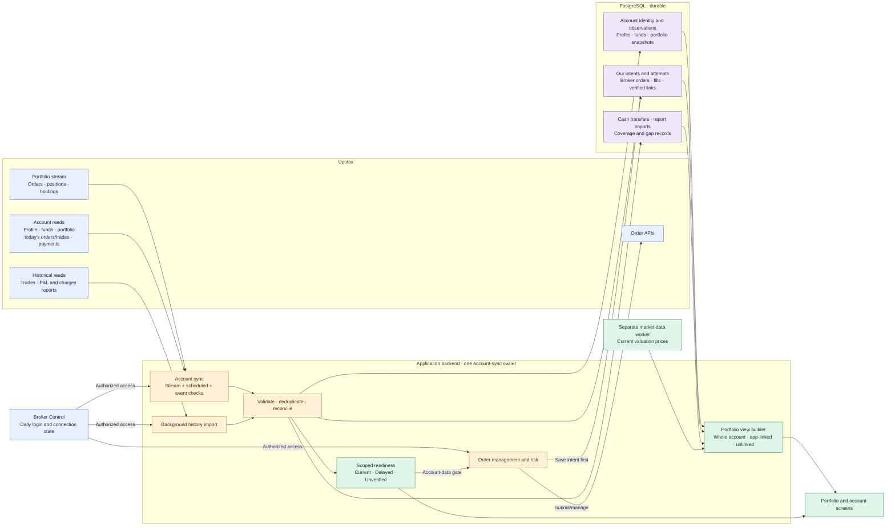

# Portfolio and Account Data Plan

Status: approved design for the original account-data scope; not implemented. GTT status acquisition was added to the OMS MVP scope on 24 September 2026 and remains to be designed in detail here. Upstox is the first broker and one application user is in scope. This document owns broker account-data acquisition, persistence, reconciliation, coverage and readiness. The [platform plan](LIVE_PLATFORM_PLAN.md) owns the overall application; the [market-data plan](LIVE_MARKET_DATA_AND_DATA_CONTROL_PLAN.md) owns prices, candles and Data Control; the [Strategy Runner plan](STRATEGY_RUNNER_PLAN.md) owns user strategy execution. Portfolio P&L formulas, order routing and protective actions need their own later decisions.

## 1. Intended result and boundaries

- Capture the **whole connected broker account**, including activity initiated outside this application. Keep the application's strategy/risk/manual instruction trace separately and link it to broker orders only with verified evidence. Unlinked broker activity remains visible; Upstox `placed_by` identifies the account user, not the mobile/web/API origin.
- Keep durable profile, funds, holdings, positions, orders, fills, cash transfers and report evidence for later analysis. Store changed full versions and opening/closing checkpoints; unchanged checks retain small receipts.
- Read current account state promptly without claiming complete historical coverage where an API cannot supply it. Show source and observation times, gaps and readiness per data area.
- Broker Control owns authorization and encrypted credentials. Account sync uses its backend connection. The strategy runner, browser and portfolio calculations do not receive broker tokens.
- Keep a small common account-data adapter: account identity/capabilities, snapshot reads, order/trade reads, payment/report reads and portfolio updates. Upstox supplies the first adapter; another broker maps its own identifiers and supported sources into the same stored account facts. Order submission remains a separate execution adapter owned by OMS.
- This uses the existing four-container baseline: application, dedicated market-data worker, strategy runner and PostgreSQL. One account-sync owner runs inside the application backend; no fifth container or host cron job is required for the MVP.

## 2. Final data flow

## 3. Upstox source-to-table map

Every successful read or accepted stream message creates an `account_observations` source record. The table column below names the additional durable facts that may change. Endpoint access and field coverage must be checked with an authorized read-only account before implementation acceptance.

| Upstox source | Purpose and resulting tables |
| --- | --- |
| [Profile `GET /v2/user/profile`](https://upstox.com/developer/api-documentation/get-profile/) | Establish broker user identity and capabilities → `broker_accounts`, `profile_versions`. A changed user ID cannot silently rebind an existing account. |
| [Funds V3 `GET /v3/user/get-funds-and-margin`](https://upstox.com/developer/api-documentation/get-funds-and-margin-v3/) | Account-wide cash, margin and pledge breakdown → `funds_snapshots`. V2 is a fallback only if its reduced fields are explicitly mapped and marked. |
| [Holdings `GET /v2/portfolio/long-term-holdings`](https://upstox.com/developer/api-documentation/get-holdings/), [positions `GET /v2/portfolio/short-term-positions`](https://upstox.com/developer/api-documentation/get-positions/), [MTF positions `GET /v3/portfolio/mtf-positions`](https://upstox.com/developer/api-documentation/get-mtf-positions/) | Complete snapshot per account and kind → `portfolio_snapshots`, `portfolio_snapshot_rows`. |
| [MF holdings `GET /v2/mf/holdings`](https://upstox.com/developer/api-documentation/get-mutual-fund-holdings/) | Separate MF snapshot and folio-aware rows → `portfolio_snapshots`, `portfolio_snapshot_rows`. |
| [Portfolio stream `WSS /v2/feed/portfolio-stream-feed`](https://upstox.com/developer/api-documentation/get-portfolio-stream-feed/) and [stream authorization URL](https://upstox.com/developer/api-documentation/get-portfolio-stream-feed-authorize/) when needed | Prompt order, position and holding observations → `broker_orders`, `broker_order_versions` and/or a targeted snapshot reconciliation trigger. The stream is not a complete historical replay. |
| [Today's order book `GET /v2/order/retrieve-all`](https://upstox.com/developer/api-documentation/get-order-book/), [order details `GET /v2/order/details`](https://upstox.com/developer/api-documentation/get-order-details/) and [history `GET /v2/order/history`](https://upstox.com/developer/api-documentation/get-order-history/) | Current-day broker order identity, state and available transitions → `broker_orders`, `broker_order_versions`; evidence for `app_broker_order_links`. |
| [Today's trades `GET /v2/order/trades/get-trades-for-day`](https://upstox.com/developer/api-documentation/get-trade-history/) and [order trades `GET /v2/order/trades`](https://upstox.com/developer/api-documentation/get-trades-by-order/) | Distinct partial executions → `broker_fill_versions`; compare their total with broker-reported order filled quantity. |
| [GTT order details `GET /v3/order/gtt`](https://upstox.com/developer/api-documentation/get-gtt-order-details/) — **new scope, detailed design pending** | Observe retrievable GTT instruction and leg states and their resulting ordinary order IDs; persist the GTT evidence separately from ordinary broker order/fill versions and link resulting orders to their GTT origin. Upstox says completed GTT orders cannot be retrieved by this endpoint, so a later read cannot prove missing completed-state history. Define cadence, source coverage, lifecycle storage and gap behavior before implementation acceptance. |
| [Historical trades `GET /v2/charges/historical-trades`](https://upstox.com/developer/api-documentation/get-historical-trades/) | Background paginated fill/trade evidence for the API-supported period → `broker_fill_versions`, `report_imports`, `report_lines` as appropriate to fields; never manufacture missing order-status transitions. |
| [Pay-ins `GET /v2/user/payments/payin`](https://upstox.com/developer/api-documentation/get-user-payins/) and [payouts `GET /v2/user/payments/payout`](https://upstox.com/developer/api-documentation/get-user-payouts/) | Distinct transfers and status changes → `cash_transfer_versions`. Each read currently returns only its most recent 20 transactions. |
| [P&L metadata](https://upstox.com/developer/api-documentation/get-report-meta-data/), [P&L data](https://upstox.com/developer/api-documentation/example-code/trade-profit-and-loss/get-profit-loss-report/) and [charges](https://upstox.com/developer/api-documentation/get-trade-charges/) | Paginated, period-scoped report evidence → `report_imports`, `report_lines`. Reports are not the live order/fill authority. |
| [MF order book](https://upstox.com/developer/api-documentation/get-mutual-fund-orders/) and [MF order details](https://upstox.com/developer/api-documentation/get-mutual-fund-order-by-id/) | Paginated MF order identity/status → `broker_orders`, `broker_order_versions` with an MF domain; MF allotment/holdings remain distinct from exchange trade fills. MF SIP registrations can be added later if the investment view needs a recurring-instruction table. |
| Broker order place/modify/cancel APIs, through the later OMS interface | Save `app_order_intents` and `app_order_attempt_events` **before** a broker action. Broker results and subsequent reads/stream messages populate broker facts and verified links. This plan does not authorize order placement. |
| Market-data worker's live prices | Supply valuation inputs to portfolio calculations; price/candle acquisition and the temporary candle cache remain in the market-data plan, outside these durable account tables. |

## 4. Durable relational model

All table names below are logical design names. Physical migration fields must implement these identities, foreign keys and unique scopes without adding a second account-history store.

| Table | Parent and invariant |
| --- | --- |
| `broker_accounts` | Stable account anchor; unique `(broker_code, broker_user_key)`. Reauthorization of the same broker user reuses it. |
| `account_observations` | FK to account; source endpoint/stream, trigger, request or event identity, success/completeness, content hash, source time if supplied, observed time, recorded time, and optional coverage window/gap reason. Full source payload for changed facts/checkpoints/distinct events; small receipt for unchanged checks. No tokens. |
| `profile_versions` | FK to account and source observation; append a version for a changed profile or checkpoint. |
| `funds_snapshots` | FK to account and source observation; typed key monetary amounts plus complete V3 breakdown evidence. A failed funds read adds no snapshot. |
| `portfolio_snapshots` | FK to account and source observation; one accepted full set for a specific kind, with row count, set hash and checkpoint/ordinary marker. |
| `portfolio_snapshot_rows` | FK to snapshot; unique within the snapshot by adapter-supplied row identity that preserves instrument, product, segment and folio where relevant. |
| `app_order_intents` | FK to selected account and, when present, strategy decision/run or application manual action. Immutable requested action and client correlation tag. |
| `app_order_attempt_events` | FK to intent; append request, acknowledgement, timeout and later attempt outcomes. Unknown submission is a distinct state. |
| `broker_orders` | FK to account; unique `(account_id, broker_order_key)` where the adapter makes broker IDs safe across any broker-specific reuse period. |
| `broker_order_versions` | FK to broker order and source observation; append changed broker state, quantity, filled quantity, prices, tag and broker timestamps. Repeated identical checks do not add versions. |
| `app_broker_order_links` | FK to app intent, broker order and supporting evidence; only one active verified originating intent per broker order. Later modify/cancel intents can be linked separately; a mistaken link receives a recorded reversal. |
| `broker_fill_versions` | FK to account, broker order when identifiable, and observation; unique broker trade identity within account/exchange/date scope plus version for a correction. Distinct partial trades are distinct fills. |
| `cash_transfer_versions` | FK to account and observation; stable identity `(account, direction, broker transaction key)` plus changed status versions. |
| `report_imports` | FK to account and source observations; report type, segment, period, expected/received pages or rows, source hash and complete/pending status. |
| `report_lines` | FK to one report import; source line identity unique within that import, with typed amounts and source detail. |

Use internal primary keys and explicit broker/account foreign keys; broker-facing IDs remain text rather than database primary keys. Store monetary amounts, prices and fractional quantities as exact decimals, with currency; do not use floating point for persisted finance facts. Store parsed times in UTC, retain original broker timestamp text in source evidence, and distinguish broker event time from our observation and database commit times. Separate endpoint reads do not form one atomic account snapshot.

Only a successful, fully validated response may make a complete snapshot. An empty *complete* response can establish no rows for that scope; an error, malformed payload or incomplete page set cannot. Save an observation and all its derived facts in one database transaction. Compare each normalized state with the latest accepted state: identical repeats yield a receipt, while a later return to an earlier value is a new version. Current views are derived from indexed accepted versions; do not create extra mutable current-copy tables or partitions for the MVP. Retain durable evidence until a separate retention/backup policy is approved; restrict access to profile/bank details and redact them from routine logs.

## 5. Acquisition schedule and ownership

The application owns one account-sync loop/portfolio socket per connected broker account. Scheduled, manual and event-driven checks converge on the same work item; coalesce duplicate requests, keep at most one in-flight read per compatible account/source scope, and use a shared account/API-group rate budget with the market-data worker. The scheduler uses the relevant exchange session and skips obsolete missed poll slots rather than replaying a backlog. A second application instance must not open a duplicate account stream or act as a second writer without explicit ownership handoff.

| Trigger | Proposed work |
| --- | --- |
| Successful daily login or reconnect | Verify account identity; read full current funds, holdings, positions/MTF, MF holdings where available, today's order book/trades and latest payments; open stream and reconcile its overlap with the baseline. |
| Stream event | Record prompt broker evidence; schedule a targeted broker read when an order, fill or account state needs confirmation. |
| After an application order action or uncertain response | Read by broker order ID or validated tag where available; reconcile today's order book/trades and affected position. Never blindly resend an unknown submission. |
| During active trading | Verify today's orders, trades, positions/MTF and funds about every minute; holdings about every five minutes. The UI reads PostgreSQL rather than triggering this work per page view. |
| While connected but idle | Reduce funds/position polling; check pay-ins and payouts about hourly. MF holdings/orders may use a daily cadence. |
| Opening/closing checkpoints | Save a full accepted account snapshot for the relevant session. A late login is labelled a late baseline rather than a fabricated opening snapshot. Run daily report imports after the session and recheck for later corrections. |
| First connection/background | Import historical trades and supported P&L/charges reports in bounded pages at lower priority than current-state checks. |

Upstox documents a `423 Locked` funds response from 00:00–05:30 IST. Record expected maintenance and fetch again after the window; do not hammer retries or treat the last value as newly confirmed. Respect `429`/retry instructions and the [published rate-limit categories](https://upstox.com/developer/api-documentation/rate-limiting/). Exact schedule thresholds are planned targets to validate with read-only broker checks, not latency guarantees from Upstox.

## 6. Evidence-led reconciliation

1. Persist the application's instruction before submission. It proves only the attempted action. An API timeout remains `Unknown`, not rejected; query by returned order ID or validated unique tag and broker evidence before any retry. The later OMS policy decides final retry/admission behavior.
2. Accept a stream event as prompt evidence of a change. Preserve distinct observations; do not make arrival time alone the authority when a later REST read disagrees or appears older.
3. Use current-day broker order reads/history to confirm order identity and status. Save every distinct actual trade as a fill; compare the sum of trade quantities with the order's broker-reported filled quantity. A position delta never creates a synthetic fill.
4. Use complete funds/position/holding reads to confirm their respective account state. A portfolio snapshot alone cannot assign a combined position to a particular strategy.
5. Link broker activity to this application only with a durable local intent plus matching returned broker order ID or validated tag and account/order evidence. Keep other broker activity unlinked; do not label it specifically as Upstox mobile or web.
6. A conflicting, missing, partial or older response is retained as evidence and makes only the affected scope Unverified. Do not silently replace a newer supported fact, zero a balance or erase a holding. Corrections append versions or link reversals.
7. After a stream gap, reread available orders, trades and account snapshots. Current state may be restored while missing intermediate transitions remain an audit gap.

## 7. Historical bootstrap and gaps

Current-state readiness uses the post-login baseline and today's evidence. Historical imports run separately and do not delay it. Capture exact source, account, product/segment and time range in observation coverage metadata, with `complete_for_available_range`, `partial`, `gap` or `pending` as appropriate. An import is complete only when all required pages and counts reconcile. Never equate API availability with complete account-lifetime history.

- [Historical trades](https://upstox.com/developer/api-documentation/get-historical-trades/) currently cover only the last three financial years. Read all supported pages in bounded background batches, preserving segment and financial-year boundaries. Older fills may remain unavailable.
- Today's [order book](https://upstox.com/developer/api-documentation/get-order-book/) and [order history](https://upstox.com/developer/api-documentation/get-order-history/) can recover a current-day order state and available transitions; they cannot promise every intermediate update after that day has passed.
- Each [pay-in](https://upstox.com/developer/api-documentation/get-user-payins/) and [payout](https://upstox.com/developer/api-documentation/get-user-payouts/) response contains only its latest 20 transactions. Detect lost overlap between consecutive reads and mark uncertain coverage; do not invent a full historical cash ledger.
- P&L and charges imports are period/segment scoped. Use metadata and pagination where supplied; a partial import remains pending and cannot become a complete report. MF order pages must likewise be exhausted before claiming coverage.
- A stream outage can leave an intermediate-event gap even when later reads prove the current order, fill and position totals. Preserve both the current-state result and the historical gap.

## 8. Scoped readiness and consumer behavior

Connection status belongs to Broker Control. The account-data layer reports `Current`, `Delayed` or `Unverified` separately for identity, orders/fills, positions, funds, holdings, payments/reports and historical coverage. `Delayed` means the last valid observation has aged past its limit; `Unverified` means a gap, incomplete response, contradiction or unknown submission prevents a supported current claim. Unsupported broker capabilities are labelled separately rather than treated as empty data. Do not use the time of the last stream *event* as a freshness clock: no order activity may be normal. Use stream connection/heartbeat, successful checks and reconciliation state.

| Scope | Planned Current rule during active trading | Consumer behavior when not Current |
| --- | --- | --- |
| Account identity | Profile broker/user ID matches the connected account after login. | Do not attach new facts or authorize account-dependent orders to a mismatched account. |
| Orders and fills | Healthy portfolio stream; successful order/trade verification within 120 seconds; no unknown submission, fill mismatch or unresolved broker conflict. | Show affected records Unverified and pause new exposure depending on them. |
| Positions/MTF | Successful complete read within 90 seconds; observed changes reconciled. | Last good value remains visible; dependent new exposure waits for reconciliation. |
| Funds | Display Current within 120 seconds; read within 60 seconds before a new cash-consuming order. | Show last good amount and time, refresh before the dependent order. Expected overnight maintenance is Delayed, never a fresh zero. |
| Holdings | Display Current within 10 minutes; read within five minutes before an action relying on holding quantity. | Dependent holding action waits for a fresh complete read. |
| Payments, reports and older history | Show their own last successful time and source-period coverage. | A reporting gap does not by itself block intraday new exposure. |

A current account may coexist with an older reporting gap. An unresolved *current* order, fill, position or funds dependency cannot be treated as ready. Portfolio screens show source/as-of time and coverage beside values, plus whole-account, application-linked and unlinked activity. OMS/risk consumes scoped readiness for its later admission policy; this plan recommends pausing new exposure that depends on Unverified state but does not decide protective-order behavior. Current market price readiness is supplied independently by the market-data worker.

## 9. Failure handling and acceptance evidence

- Auth expiry or manual disconnect stops authorized calls and stream use; keep the last good snapshots labelled with age. A fresh login starts identity verification and a new baseline. Credential generations cannot mix observations from an old connection into the newly authorized one.
- A stream disconnect, process restart or stale owner marks affected scopes Unverified until an owned socket and full available reads reconcile. Do not claim lossless replay.
- API errors, schema drift, partial pages, database failure and rate waits create visible observations/status. They do not replace accepted values or make a product falsely Current. Current-state reads take priority over historical imports.
- Back up durable account/trading evidence and its required decryption keys with the platform's off-host backup/restore plan. Disposable market candle cache is managed separately. A restore must re-establish identity, coverage and account readiness before any trading resume decision.

Before accepting implementation, demonstrate with a fake broker and PostgreSQL: duplicate stream/REST events; out-of-order or conflicting order states; partial fills and corrections; outside-app orders; uncertain order submission; complete empty versus failed snapshot; pagination failure; missing payment overlap; stream reconnect; daily renewal; funds maintenance/`429`; and restart/restore. Verify API fields, timestamps, supported products and proposed freshness thresholds with an explicitly enabled **read-only** Upstox account session. The portfolio UI must show the correct account, as-of time, scope status and coverage. Passing these checks is account-data readiness evidence, not live-order authorization or a validated P&L report.
