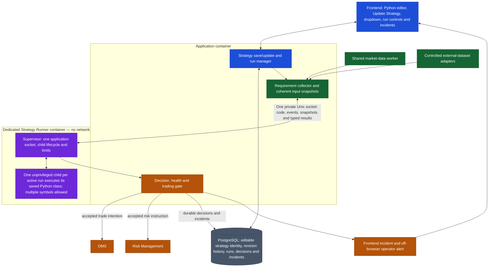
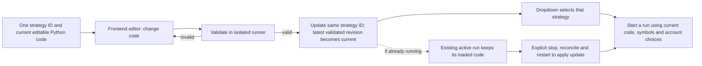

# Money Printer Live — Strategy Runner plan

Status: Approved design plan for the current single-user scope. No runner, frontend editor, database schema, isolation controls or live-trading tests have been implemented. Last updated: 23 September 2026.

This document owns saved Python strategies, run control, event evaluation, runner isolation, decision handoff and runner-failure notification. The [overall platform plan](LIVE_PLATFORM_PLAN.md) owns module boundaries and deployment direction; the [market-data and Data Control plan](LIVE_MARKET_DATA_AND_DATA_CONTROL_PLAN.md) owns shared acquisition, candle correctness and data readiness. This runner plan does not define broker order or risk-protection policy.

## 1. Approved shape

- The user creates and edits a Python strategy class in the frontend. A strategy has one stable strategy ID and appears once in the dropdown. Updating it saves new current code under the same ID.
- A running instance has its own run ID, selected symbols, parameters and broker/account routing configuration. The same strategy may have several runs; one run may use several symbols and timeframes.
- Target 100 concurrently active runs. This is a workload to prove on the intended host, not a claim that any 100 classes will fit.
- Classes declare shared market-data and optional external-data requirements. They can wake on completed candles, live prices, scheduled times, committed external-dataset updates, or any combination. They return trading and risk intentions.
- User Python executes in one dedicated, network-isolated Strategy Runner container. The application owns persistence, data access, authorization, decision admission and handoff to OMS/Risk Management. The runner never has broker credentials.
- A failure blocks new intentions from affected runs, creates a visible frontend incident and requires reconciliation and an explicit resume. Off-browser critical alerting is a release requirement.

## 2. Updated architecture

This is one application-to-runner socket, not one socket per strategy. The socket is a local communication channel so the runner can exchange bounded messages while its container has no network access. Child processes cannot open that socket; they receive work from the supervisor through bounded pipes. The frontend never connects to the runner.

## 3. Editing, validation and activation

The application bounds the submitted source and asks a constrained runner child to compile and validate its declared interface. A failed update leaves the current selectable strategy unchanged and shows errors in the editor. The frontend presents one editable strategy, not separate dropdown entries for each change.

For audit and recovery, each successful update appends a revision under the same strategy ID; the latest validated revision is current. Earlier code is retained internally, not exposed as another strategy. A run records the exact code revision/hash it loaded. Updating a strategy while it trades does **not** hot-swap its code. The frontend shows that the saved strategy was updated while the active run still uses its loaded code; applying the update requires an explicit stop, broker/order reconciliation and new start. Acknowledging a prompt does not silently switch code.

The frontend controls symbols, parameters and broker/account selection. The strategy class cannot choose broker credentials or bypass the selected routing configuration.

## 4. Small Python class contract

| Method | Contract |
| --- | --- |
| describe(config) | Declare exact instruments/products/timeframes/lookbacks, optional external datasets, readiness/freshness, wake events and whether a live-price stream may coalesce to latest state. The loader does not infer requirements from arbitrary imports or code inspection. |
| initial_state() | Return small serializable state scoped to this run. It may contain separate symbol state and shared cross-symbol state. |
| evaluate(event, snapshot, state) | Return next state, zero or more trade intentions and zero or more risk instructions. It receives an immutable snapshot and does not open broker, database or external connections. |

The runtime wakes a run on the union of its declared event sources. The class evaluates its combinations against the supplied snapshot and explicit run state: AND/OR conditions, ordered sequences, new source versions and bounded time windows are ordinary Python logic. A completed candle is distinct from a developing bar; a delayed history repair or correction is context, not automatically a fresh trade trigger. Scheduled events use the selected exchange/session timezone. External-dataset update events are emitted only for committed, versioned data.

An event carries type, affected identity, stable event ID, source/market time, availability time, delivery generation and correction/gap status. The snapshot carries exact instrument and product identity, values, versions, freshness/readiness and the relevant decision clock. The runtime never presents stale or incomplete input as Ready. A multi-symbol run declares whether its inputs form one cross-symbol readiness group or independent symbol groups; only a fully ready group may produce an intention. One run evaluates events in order and has at most one evaluation in flight; different runs may execute concurrently.

The class attaches a logical opportunity key to each intended action. The application uses run ID plus this key and action identity to prevent duplicate handoff when several event types satisfy the same setup. Trading and risk intentions are linked; a strategy's requested stop is not represented as broker-confirmed protection. Risk Management must use actual fills and broker state under its separately planned rules.

## 5. Runner isolation and limits

The deployment has four containers: application, market-data worker, Strategy Runner and PostgreSQL. The runner has one supervisor and one child process per active run. Each child uses a distinct unprivileged UID; only the supervisor can access the application socket. The supervisor drops child privileges and capabilities before loading or validating user code, closes unrelated file descriptors and uses bounded parent/child pipes. A child cannot read another run's private temporary directory or process memory. No Docker API is exposed to the application or runner, and no container is created per run.

The runner uses Docker network mode none and publishes no port. It has no database connection, broker credential, data-worker socket, host path, device or Docker socket. It uses a read-only root filesystem, size-limited ephemeral temporary storage, a narrow shared socket mount, no-new-privileges, Docker's default seccomp profile and only the supervisor capabilities needed to change child UID/GID. Approved Python dependencies are pinned in the runner image; user code cannot install packages during a run. The app/runner socket directory is inaccessible to child UIDs and the supervisor verifies its application peer. Docker's [network mode](https://docs.docker.com/compose/how-tos/networking/), [service controls](https://docs.docker.com/reference/compose-file/services/) and [seccomp profile](https://docs.docker.com/engine/security/seccomp/) support this boundary; implementation must verify it on local Docker and the GCP Linux host.

| Limit | Enforcement and failure behavior |
| --- | --- |
| Active runs | At most 100 by product policy, further reduced by measured CPU/memory/event and unique-instrument admission. A request above safe capacity is rejected visibly. |
| Evaluation | One in flight per run, with a wall-time deadline. Timeout ends that child and halts the run. |
| Event inbox | Bounded by count, bytes and age. Latest-price coalescing occurs only when declared; loss of a strict event creates a visible gap and halts trading for that run. |
| Memory, CPU and processes | Hard runner-container cgroup ceilings and PID limit; child memory watchdog and process-creation limit. Exhaustion halts affected runs and never silently drops work. |
| Source, input, output and logs | Bound code size, each message and captured output. Oversized or malformed content is rejected; logs cannot grow without limit or leak credentials. |

No live activation is allowed with an absent or unenforceable limit. Numeric ceilings, maximum admitted lookbacks and evaluation deadlines are set from representative workloads and host resources before release; this plan does not invent performance guarantees. The 100-run test includes combined symbols/timeframes and event rate. It also checks the separate data-plan target of 26–100 unique active instruments; 100 multi-symbol runs may demand more instruments and require an explicit capacity decision.

## 6. Decision handoff and state

The runner returns typed results only. The application validates the result schema, current run generation, code hash, selected symbols, input readiness, output size and opportunity identity. It records the accepted decision and necessary input versions/values durably before handing trade intentions to OMS and risk instructions to Risk Management. An unavailable durable decision store blocks new trade admission. Late results from an old generation are rejected. The application's decision record links run, symbol, triggering event, code revision, inputs, intention and subsequent broker-account actions.

The child owns only working computation state. The application persists minimal state checkpoints needed for safe recovery, associated with run and code revision; it does not require a database write on every price update. A strategy whose state cannot be reconstructed from declared inputs/checkpoints remains halted until a new valid setup and explicit resume. Historical catch-up restores context but never replays old events as fresh trade triggers. A restarted runner never resumes trading automatically.

## 7. Failure detection and user notification

| Failure | Immediate application response | User-facing status |
| --- | --- | --- |
| One child crashes, times out, exceeds a limit or returns malformed output | Close that run's new-trade gate, reject late results and record an incident. Other healthy runs continue. | Persistent red run incident with reason, symbols, time, last healthy input and affected orders/positions. |
| Strict event loss or required input becomes unready | Close the affected dependency group's gate; if the strategy needs a cross-symbol group, halt that whole run until repair. | Missing/stale product and last usable time shown; never display the affected group as Ready. |
| Runner supervisor/socket heartbeat is lost | Close all run gates and record a runner incident. | Global red banner listing affected runs; status remains unresolved after reconnect. |
| Application/browser connection is lost | An open frontend page detects missing application heartbeat; an independent monitor covers application/host outage. | Page displays **Trading status unknown**. No assumption is made about order or protection state. |
| Database or audit handoff is unavailable | Block new trade admission; preserve any already broker-accepted order identity for reconciliation. | Critical incident; records and broker status marked unknown where not verified. |

The frontend loads current incidents on open/reconnect, receives authenticated sequenced status updates from the application and falls back to periodic snapshots if the stream fails. The alert is persistent, not a temporary toast. It distinguishes **new entries blocked** from **existing broker orders**, and labels position protection **confirmed**, **absent** or **unknown** based on actual broker reconciliation. Acknowledging an incident only marks it seen.

An open browser cannot notify a user who is away, and an application failure cannot push a new message. Before live use, configure and drill an operator notification destination for critical run/runner incidents plus host-external application monitoring, using the platform's GCP operations policy. [Cloud Monitoring alert policies](https://docs.cloud.google.com/monitoring/alerts) support external notification channels; the selected destination and timing must be verified. The exact risk action for broker-held versus application-monitored protection belongs to the later Risk Management plan. Runner isolation by itself does not prove an open position is protected.

## 8. Recovery and operator controls

After any halt, the application must establish runner health, matching saved code/run generation, required input readiness, actual broker orders and positions, and risk-protection status. The frontend presents these separately. The user explicitly requests resume; the application records that action and starts a new run generation only after its gates pass. If any broker result remains unknown, the run cannot be shown Ready for new entries. Stopping or editing a strategy never blindly cancels a broker-held order or claims a stop is still active.

Run controls show Requested, Warming, Ready, Running, Paused, Degraded, Halted and Recovering as distinct states. A user action is not shown as applied until the runtime acknowledges it. Restarting the container, renewing a broker token or reconnecting the data stream alone does not authorize resume.

## 9. Build and acceptance sequence

1. Build the runner container, one private socket, supervisor, UID-separated child lifecycle, isolated code validation and enforceable resource ceilings; test isolation attacks before enabling signal handoff.
2. Implement the editable frontend strategy record, same-ID update, dropdown, run configuration and exact-code audit identity using that isolated validation.
3. Connect declared requirements to the shared data worker and external adapters; implement ordered per-run events, coherent snapshots, combination rules, readiness and strict-gap behavior.
4. Add durable idempotent decision handoff, per-run health gating, incident records and frontend status/alert delivery.
5. Add operator reconciliation and explicit resume, then off-browser alerts and host-external monitoring.
6. Verify representative 100-run concurrency locally and on the intended GCP host, including multiple symbols, live-price bursts, slow calculations and failure drills.

Acceptance evidence must show: frontend edits update the same strategy ID; invalid changes do not replace current valid code; running code never hot-swaps; each order traces to exact code and input evidence; user code cannot reach network, credentials, database, Docker socket or other runs; limits and fault gates work; frontend and off-browser alerts arrive; broker protection is never falsely reported; no historical replay creates fresh orders; and recovery requires explicit resume. Passing component tests alone does not authorize live-money use.
